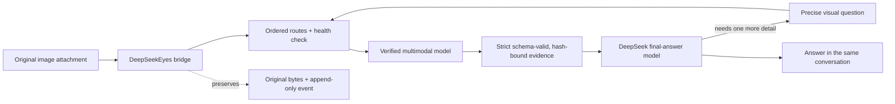

<p align="center">
  
</p>

<p align="center">
  
</p>

<h1 align="center">DeepSeekEyes</h1>

<p align="center"><strong>Give DeepSeek sight without leaving the conversation.</strong></p>

<p align="center">
  An auditable vision, MCP and cross-platform Computer Use runtime for
  <a href="https://github.com/deepseek-ai/deepseek-harness">DeepSeek Harness</a>.
</p>

<p align="center">
  <a href="README.zh-CN.md">简体中文</a> ·
  <a href="#see-it-in-action">Live screenshots</a> ·
  <a href="#quick-start">Quick start</a> ·
  <a href="#how-it-works">How it works</a> ·
  <a href="#computer-use">Computer Use</a> ·
  <a href="#mcp-application-layer">MCP applications</a> ·
  <a href="#token-accounting">Token accounting</a> ·
  <a href="https://x.com/lucars2026">X / @lucars2026</a>
</p>

<p align="center">
  <a href="https://x.com/lucars2026"></a>
  <a href="https://github.com/dttxorg/deepseekeyes/releases/latest"></a>
  <a href="https://www.npmjs.com/package/@dttxorg/deepseekeyes"></a>
  <a href="https://github.com/dttxorg/deepseekeyes/actions/workflows/ci.yml"></a>
  
  = 22.19" />
  <a href="LICENSE"></a>
</p>

DeepSeek's strongest text models can reason about code, documents and interfaces, but they do not consume image pixels. **DeepSeekEyes is the DSH runtime that makes those pixels auditable:** it selects and health-checks visual routes, validates every nested evidence field, binds evidence to original bytes, records failover, and keeps DeepSeek as the reasoning model.

No window switching. No manual transcription. No lossy screenshot relay.

This is not another captioning window. It is the **DSH auditable vision, Computer Use and MCP application runtime** for image evidence, structured app calls, Browser automation and native Windows/macOS control.

## See it in action

These are real DeepSeek Harness captures, not product mockups. The captures show the image and Browser loops; the MCP tool loop is documented separately below:

- **Image understanding:** paste an image → the configured multimodal model reads the original pixels → DeepSeek receives validated evidence and answers in the same task.
- **Browser control:** ask DeepSeek to open a page → Browser Computer Use observes, opens, scrolls and clicks → every action returns a fresh state so DeepSeek can verify the result or recover from a missing target.
- **Structured app calls:** enable an MCP server and select only the required tools → DeepSeek calls the application in the background → DeepSeekEyes bounds, hashes and audits the result → DeepSeek verifies the requested outcome from returned or read-back evidence.

<table>
  <tr>
    <td width="50%" valign="top">
      <strong>One visible DeepSeekEyes route</strong><br />
      <sub>The model picker exposes the DeepSeek final-answer model and its multimodal “Eyes” model as one selectable route.</sub><br /><br />
      
    </td>
    <td width="50%" valign="top">
      <strong>Harness-native visual routing</strong><br />
      <sub>Select both Provider/model pairs, inspect the live route, enable automatic capability detection, randomized pixel probing, health checks and failover.</sub><br /><br />
      
    </td>
  </tr>
  <tr>
    <td width="50%" valign="top">
      <strong>Understand a pasted screenshot</strong><br />
      <sub>The image stays in the current task while DeepSeek returns a structured description of layout, navigation and visible content.</sub><br /><br />
      
    </td>
    <td width="50%" valign="top">
      <strong>Control and verify a browser</strong><br />
      <sub>The agent opens the site, inspects the live page, scrolls, follows the correct navigation path, clicks Login and verifies the resulting authentication page.</sub><br /><br />
      
    </td>
  </tr>
</table>

## Why DeepSeekEyes

| Requirement | What DeepSeekEyes does |
| :-- | :-- |
| **One conversation** | Image → vision evidence → DeepSeek reasoning → optional visual follow-up all happen inside the current Harness task. |
| **Original pixels stay authoritative** | User images are not resized, converted or recompressed. Every reread references the original content-addressed attachment. |
| **The models can communicate** | DeepSeek can request a precise region or detail instead of depending on one oversized first description. |
| **No surprise text overhead** | With optional automation and MCP disabled—the default—pure-text turns keep the direct model path with no visual call or tool schema. MCP schema/result estimates become visible when tools are explicitly exposed. |
| **The eye is verified** | Static image-capability metadata is followed by an optional randomized 3×3 pixel probe. A text-only model cannot silently pose as the eye. |
| **Routes fail over visibly** | Ordered visual routes, health TTL, circuit cooldown and bounded attempts are persisted without prompt/image contents. |
| **Evidence is a contract** | One public JSON Schema drives strict Ajv validation; bounded local canonicalization repairs only known structure/scalar formats and audits every change. |
| **Automation is built in** | Browser Computer Use plus native Windows/macOS desktop control can observe, act, verify and preserve evidence. |
| **Structured hands are built in** | The MCP control center connects stdio or Streamable HTTP servers while exposing only an explicit tool allowlist. |
| **Usage is visible** | The native settings card separates exact Provider usage, estimated bridge input and normal final-answer usage. |

## Quick start

### 1. Install, upgrade or diagnose

```bash
npx -y @dttxorg/deepseekeyes@latest install
npx -y @dttxorg/deepseekeyes@latest upgrade
npx -y @dttxorg/deepseekeyes@latest doctor
```

These commands work in macOS/Linux shells and Windows PowerShell. Use `--profile NAME` when the DSH profile is not `web`. Restart `dsh web` once after installation or upgrade.

### 2. Configure entirely in Harness

1. Open **Settings → Models** and add the text Provider/model and multimodal Provider/model you already use.
2. Open **Settings → Plugins → DeepSeekEyes**.
3. Select:
   - **Final answer Provider + model** — the DeepSeek model that reasons and replies;
   - **Background vision Provider + model** — the multimodal model that reads pixels.
4. Keep the randomized pixel probe enabled for the first real image.
5. Save, then select the `DeepSeekEyes` model entry in the conversation model picker.

Custom OpenAI-compatible gateways can be declared image-capable from the same card; the plugin writes the exact Harness `defaultInput: [text, image]` setting without replacing sibling Provider fields.

### 3. Paste an image

Ask normally:

> Read this screenshot, identify the failure, and tell me the next action.

DeepSeekEyes automatically reads the new image, gives DeepSeek structured evidence, and preserves the original for later targeted questions.

## How it works



The first read is deliberately not the end of the visual conversation. DeepSeek may emit a bounded private clarification request naming the image SHA-256, one exact question and an optional normalized region. The eye rereads the original pixels and returns targeted evidence; DeepSeek then continues reasoning.

Historical images are compacted into bounded SHA-256 pointers. They cause no automatic reread, but the session-scoped `deepseekeyes_look` tool can recover one preserved original on demand—even after switching to a native text-only model.

## Capability matrix

| Capability | Status | Notes |
| :-- | :--: | :-- |
| Native pasted-image bridge | ✅ | Original Harness attachment stays in the append-only session log. |
| DeepSeek ↔ vision clarification | ✅ | Bounded, precise questions against the same original image. |
| Vision-model capability probe | ✅ | Metadata gate plus randomized pixel test. |
| Canonical evidence JSON Schema | ✅ | One source drives prompts and rejects invalid nested fields. |
| Route health and failover audit | ✅ | Priority, health TTL, circuit cooldown and bounded attempts. |
| Custom multimodal gateways | ✅ | OpenAI-compatible routes can be declared from the GUI. |
| Browser Computer Use | ✅ | Open, observe, click, type, select, wait, assert, report and close. |
| Windows desktop Computer Use | ✅ | Window capture + UI Automation elements/actions + user32 input. |
| macOS desktop Computer Use | ✅ | Window capture + Accessibility elements/actions + CoreGraphics input. |
| MCP application tools | ✅ | Harness-native stdio/Streamable HTTP **tool** client, bounded captured catalog, allowlists, health, hard result admission, bounded previews, atomic image admission and audit. Remote Streamable HTTP requires `https://`; plaintext HTTP is loopback-only. MCP Resources/Prompts are not bridged in 0.6. |
| Lossless oversized screenshots | ✅ | Recompressed without pixel changes, then tiled only when the Host's 5 MB limit requires it. |
| Local Token accounting | ✅ | Exact Provider usage plus clearly labelled bridge estimates. |
| Public visual eval | ✅ | Screenshot, dense text, chart, UI and prompt-injection cases with accuracy/latency/Token output. |
| Pure-text isolation | ✅ | No visual call, screenshot or Computer Use prompt when none is needed. |

## Computer Use

Both automation modes are **off by default** and are enabled independently from **Settings → Plugins → DeepSeekEyes**.

The control cycle follows the same core shape as the [official OpenAI Computer use loop](https://developers.openai.com/api/docs/guides/tools-computer-use): observe the current UI, execute a typed action, capture the resulting state, and continue. DeepSeekEyes implements that cycle as auditable DSH tools and additionally exposes native accessibility elements when the operating system provides them.

### Browser Computer Use

The Playwright-powered browser loop returns a fresh screenshot and semantic element references after every action. Mutations require the latest `stateId`, stale actions are rejected, and an assertion/report loop turns the same feature into an automatic test runner.

Supported operations include navigation, observation, click, type, select, check, keyboard input, wait, visual assertions, evidence reports and session close.

### Windows / macOS Desktop Computer Use

The native `computer` tool can:

- discover the desktop, then observe only the target window to reduce irrelevant pixels;
- return stable `windowRef` and `elementRef` identities, semantic roles, names, values, bounds and available actions;
- move, click and drag the pointer;
- click or invoke semantic elements, assign control values, type Unicode text and send keyboard shortcuts;
- scroll, wait, launch and focus applications;
- move, resize and close windows;
- return a screenshot/window/element `stateDelta` after every step;
- preserve a fresh lossless PNG after every step while avoiding a visual-model call when semantic/action evidence is sufficient;
- run native element/window/screen assertions, fall back to visual assertions for pixel-only facts, and save v2 evidence reports.

`launch` is stateless: it can run before `observe`, and macOS accepts a display name, a renamed alias resolvable by Launch Services, a bundle ID, or a full `.app` path. Focus by application/title is also stateless. Mutations based on pixels or refs remain bound to the newest screenshot state; read-only `observe` may reuse the current `windowRef` without repeating `stateId`.

Since 0.5.8, desktop text entry is target-bound instead of trusting whichever control happens to own keyboard focus. The vision model grounds pixel-only controls in the exact delivered screenshot, DeepSeek supplies the plan and text, and the native runtime performs one guarded transaction: focus the intended window → click/focus the intended control → verify the foreground window/modal state → enter text → capture the result. `type` therefore requires either `elementRef` or complete `x/y` coordinates; coordinate input also binds to `windowRef` or the latest window-scoped observation. A targetless call is rejected before mutation unless `allowFocusedTarget: true` explicitly opts into the compatibility path.

`TARGET_FOCUS_MISMATCH`, `DESKTOP_MODAL_TARGET_BLOCKED`, `DESKTOP_COORDINATE_SPACE_MISMATCH` and `DESKTOP_TYPE_COORDINATE_OUTSIDE_WINDOW` all mean that text was not sent. Observe again, handle the modal or reground the control in the new screenshot, then retry with the new `stateId`. On Windows the helper uses atomic focus/click plus `SendInput`; on macOS semantic text uses Accessibility selected-text insertion, while coordinate-only Unicode input uses a full pasteboard snapshot/restore transaction.

Every action captures and preserves another lossless PNG. The default `desktopVisualMode: auto` routes complete semantic observations and successful mutations directly to the final text model, so those steps make **zero visual-model calls**. Sparse/disabled accessibility states still receive pixels automatically for `observe`, `launch` and `wait`; the model can request exact current pixels on any call with `includeScreenshot: true`. `always` retains full per-step visual auditing, while `manual` delivers pixels only on explicit requests. Omitting pixels from a model turn never deletes or recompresses the stored screenshot.

A known target remains window-scoped; an explicit application/title always overrides the previous capture. On macOS, the runtime prefers the focused/main usable window over tiny auxiliary dialogs and walks Accessibility children under both the configured element bound and a helper-time budget, avoiding an unbounded Electron tree scan. `semanticStatus` reports availability, truncation/limit reason and elapsed semantic time. `timings` reports native round-trip, semantic collection, screenshot processing and total tool time; `visualDelivery` explains whether vision was invoked or bypassed. Coordinates are relative to a delivered image and are mapped back to native desktop coordinates. Native Desktop Computer Use is implemented for Windows and macOS; Browser Computer Use remains available wherever the configured Chromium runtime is available.

On Windows, the native helper consumes and emits UTF-8 JSON under Windows PowerShell 5.1 and converts screenshot-relative coordinates through scalar screen origins before calling `user32`. Window-scoped clicks therefore honor negative/multi-monitor origins without the PowerShell `System.Object[] / op_Addition` failure. Cross-platform CI parses the PowerShell helper and executes the real Windows coordinate path rather than only testing JavaScript simulation.

If every bounded visual route fails for a `computer` screenshot, the original PNG, hash and route attempts stay preserved and DeepSeek continues from the adjacent native state (`actionResult`, windows, accessibility elements and `stateDelta`). The fallback explicitly states that pixels were not decoded. Pasted user images and explicit pixel-dependent reads remain strict and still fail when no validated evidence exists.

Computer Use model calls are isolated from unrelated long-task history by a default **32,768-token automation context budget**. Only the model-facing copy is bounded: the newest direct user instruction, atomic tool-call/result tail, full DSH task, screenshots and reports remain preserved. A second guard stops after 32 final-model calls for one user instruction. Both limits accept custom values and explicit `0` unlimited mode. Ordinary text and non-automation image turns never enter this guard.

## MCP application layer

DeepSeekEyes 0.6 adds the missing product layer around DSH's official `@deepseek-ai/dsh-mcp-client@0.1.0-rc.6` and matching `@deepseek-ai/dsh-tools@0.1.0-rc.6` renderer API. Both are loaded from DSH's managed `$DSH_HOME/profiles/node_modules` Host fallback and canonicalized to the Host installation instead of being installed as duplicate plugin dependencies; even a profile-local shadow cannot split Cordis or tool-scheduler identity. Configure it under the default-collapsed **MCP apps and tools** section—no manual `cordis.patch.yml` entry is required.

- Connect local **stdio** servers or remote **Streamable HTTP** endpoints. Remote endpoints must use `https://`; `http://` is accepted only for an explicit loopback hostname/address such as `localhost`, `127.0.0.1` or `[::1]`.
- Test a real transport/tools-list round trip, force a fresh transport generation for discovery, and reconnect from the settings card. Status polling reuses a successful health result for 30 seconds, then performs one shared live probe instead of trusting stale captured tools.
- Store only credential **environment-variable references**: stdio `env` entries and Streamable HTTP headers name variables from the `dsh web` process environment; plaintext tokens, credential-bearing arguments and credential-bearing URLs are rejected.
- Expose zero tools by default; each new allowlist starts empty, and a deny selector always wins over an allow selector.
- Reject a persistent captured catalog atomically if it exceeds 256 tools, 1,000,000 measured schema characters, 4,000,000 UTF-8 schema bytes, schema depth 64 or 100,000 schema nodes. A previously non-empty generation becoming empty is withdrawn and marked unverified until a matching live probe confirms that zero tools is the server's real healthy state.
- Enforce the separate `mcpMaxTools` exposure budget and estimated Schema Token budget after capture, before any allowlisted definition reaches a model request. Raising that exposure budget does not relax the fixed capture limits.
- Isolate schemas and MCP guidance to the DeepSeekEyes virtual Provider. Non-DeepSeekEyes prompt assembly strips both, and wrong-Provider or agentless execution is rejected again before the external call.
- Carry nested Code Mode MCP outcomes through the Harness Host's `deferContext()` channel as a trusted plugin-authored `mcp-context` message. Every successful or failed sub-call contributes a compact status/hash marker; image outcomes carry only immutable Harness attachment references, never inline base64. The next model continuation is therefore classified as MCP automation and enters the same context/call guards and `upstreamMcp` accounting. Native MCP calls already render their own result and do not add this duplicate context. A Code Mode Host without that channel fails before the external call with `MCP_RESULT_CONTEXT_UNAVAILABLE`.
- Suspend all MCP exposure before asynchronous stop or reconfiguration cleanup starts. Schemas and guidance remain absent while any old transport is closing, and only the validated replacement generation is republished after cleanup, so a slow or failed close cannot leave stale tools callable.
- Admit every successful adapter result through fixed hard limits **before** DeepSeekEyes canonicalization, base64 decoding, attachment writes or artifact persistence: depth 64, 50,000 nodes, 4,096 content blocks, 16 Mi characters of aggregate non-image strings, 8 images, 28 MiB encoded image data, 20 MiB decoded image data and 20 MiB other binary data.
- Apply `mcpMaxResultChars` only after that admission as the model-preview budget. Oversized or non-text canonical JSON from the admitted adapter value is written to a private SHA-256-addressed local artifact by default. A write/rename failure rejects the result and always attempts to remove its temporary file without replacing the original error. With `mcpArtifactDir: false`, no complete artifact/reference is claimed: delivered images are labelled as attachments and omitted raw image/audio/resource blocks are labelled as not retained.
- Submit all image blocks in one `ctx.attachments.saveImages()` batch so the current Harness Host owns count, aggregate-byte, media and raster admission. Older saveImage-only Hosts use a bounded compatibility path that validates the whole batch before sequential writes. Returned attachments then enter the normal original-pixel visual evidence loop.
- Keep error audit content correlation-only: stable/redacted error code plus SHA-256 of the error message, without persisting the message itself.

MCP is the preferred hand for an application with a structured server/API and usually works without bringing its window to the foreground. Browser Computer Use remains the fallback for websites without MCP; Desktop Computer Use remains the fallback for UI-only native applications.

Every enabled tool schema consumes model context even when the tool is not called. DeepSeekEyes therefore keeps MCP off with no configured servers by default, starts each new allowlist empty, shows the live schema estimate, and applies the existing automation context/call guards to MCP continuations.

The 0.6 `automationMaxCallsPerTurn` guard counts final-model continuation requests; it does **not** cap how many MCP sub-calls one `run_code` execution can issue. The current ToolRuntime supplies concurrency control and per-call timeout, while DeepSeekEyes does not yet add a cumulative per-run external-call limit or wire a separate approval prompt for every sub-call. Default-off MCP, empty allowlists, narrow credentials and server-side rate limits reduce this exposure but are not a count limit. The P1 roadmap item is `mcpMaxExternalCallsPerRun` (recommended default `64`, explicit `0` unlimited), enforced before each managed external call.

First connection: add the server, enter only credential environment-variable names, save, run **Test connection**, refresh discovery, select the exact tools required, save again, and use the `DeepSeekEyes` route in the conversation. The runtime will not expose a discovered tool merely because the server connected.

The 0.6 boundary is deliberately narrower than “all of MCP”: it bridges server **tools** only. MCP Resources and Prompts, interactive OAuth, and a general background UI driver are not provided. Background operation therefore requires a server that exposes the needed operation as a tool and accepts credentials through process-environment references; apps without such a server still use Browser or Desktop Computer Use. A successful tool response is evidence, not proof that an external state changed, so the agent must inspect the bounded result or call a read tool to verify writes.

The pinned official rc.6 client and MCP SDK decode the transport response before the result reaches DeepSeekEyes. For every response whose `content` is an array, rc.6 walks the blocks and joins their extracted text **before** it checks `isError`; a successful call discards that temporary joined string and returns the blocks, while a failed call throws the string as an exception. The fixed admission limits above therefore govern only the successful adapter value **after** that dependency boundary. DeepSeekEyes bounds and redacts an already-created upstream exception before surfacing it, but does not claim to bound the SDK's earlier network decode or this pre-admission extract/join allocation.

The same dependency boundary applies to discovery: rc.6 completely drains and validates all `tools/list` pages and builds its in-memory definition map before calling DeepSeekEyes' CaptureRegistry. The fixed catalog limits atomically bound what DeepSeekEyes subsequently retains, sorts and exposes, but they cannot pre-limit the bytes of one network page, the number of cursor pages or rc.6's temporary pre-capture map.

## Token accounting

The native plugin card exposes **Token usage statistics** without making a statistics model call.

| Counter | Meaning |
| :-- | :-- |
| **Exact additional Tokens** | Provider-reported pixel probe, initial read, targeted reread, visual clarifications and every DeepSeek call caused by Browser/Desktop/MCP tool use. |
| **Estimated bridge input** | Evidence/protocol/tool text injected by the plugin, estimated with the Harness fixed-density rule. |
| **Estimated plugin total** | Exact additional usage plus estimated bridge input. |
| **Final model visual-turn usage** | The single ordinary visual-turn final answer is recorded separately; automation final-model calls are included above. |
| **Automation protection** | Protected user instructions, context compactions, limit stops and estimated replay input avoided. |
| **MCP attribution** | External call count, final-model `upstreamMcp` usage, schema-input estimate, result-input estimate, MCP compactions and MCP limit stops. Code Mode success/failure contexts keep nested sub-calls on this path. Schema/result estimates are subsets of Provider input usage and are not added twice; `both` mode estimates the native definition and generated `tools:sdk` declaration as two real input surfaces. |
| **Operational counters** | Visual turns, original-image rereads and vision-cache hits. |

Statistics refresh/reset uses the loopback-only `/deepseekeyes` RPC. Data is atomically stored at `$DSH_HOME/deepseekeyes/usage-stats.json` with mode `0600` and a 50-session detail limit. A temporary write failure keeps counting in memory and does not interrupt the user's turn.

Disable collection in the GUI or use:

```bash
export DEEPSEEKEYES_USAGE_STATS=false
```

## Data integrity by design

- User images pass through `ctx.attachments.readImage()` as the original Harness `ImageBlock`.
- Original MIME type, byte length, dimensions and SHA-256 are recorded with the evidence.
- Visual evidence is validated against the public [`schemas/visual-evidence.schema.json`](schemas/visual-evidence.schema.json) before DeepSeek sees it; a compact example is generated from that source, reasoning-prefixed outputs select the final matching evidence object, and every nested object still rejects extra fields.
- Missing empty lists and common numeric confidence/bbox forms are canonicalized locally with a field-level audit. One recognizable incomplete SSE stream may retry once on the same route; both call usages are counted.
- Common model coordinate conventions (normalized/pixel `xywh`, normalized/pixel `xyxy`, and Qwen 0–1000 `xyxy`) are deterministically normalized and audited without another model call.
- A targeted reread references original pixels—not a thumbnail, JPEG copy or summary of a summary.
- Failed direct-image reads, invalid evidence and exhausted clarification bounds stop the visual turn instead of inviting a guess. Desktop tool screenshots alone may fall back to their explicit native semantic state, never to invented pixel claims.
- Browser/Desktop screenshots carry content-addressed state and stale-action protection.
- Typed text, assigned values and launch arguments are hashed in persisted Computer Use reports.

## Configuration reference

The common route and automation settings are available in the GUI. Headless deployments may use the same fields in `cordis.patch.yml` or environment variables.

| Area | Important fields |
| :-- | :-- |
| Model routing | `upstreamProvider`, `upstreamModel`, `visionProvider`, `visionModel` |
| Vision validation | `autoDetectVision`, `activeProbe`, `maxClarifications` |
| Route reliability | `visionRoutePriority`, `visionHealthCheck`, `visionFailoverAttempts`, health TTL/cooldown and attempt retention |
| Visual budgets | `baseMaxTokens`, `targetMaxTokens` — `0` delegates the limit to the Provider |
| Automation spend guard | `automationContextMaxTokens` (default `32768`) and `automationMaxCallsPerTurn` (default `32`); `0` disables either limit |
| History bounds | `historyImageLimit`, `historySummaryChars`, `browserHistoryLimit`, `desktopHistoryLimit` |
| Browser | `browserComputerUse`, channel/executable, viewport, timeout and observation bounds |
| Desktop | `desktopComputerUse`, `desktopVisualMode`, `desktopSemantic`, `desktopMaxElements`, timeout, settle delay, display, PowerShell and evidence directory |
| MCP | `mcpEnabled`, `mcpServers`, allow/deny tools, `mcpMaxTools`, `mcpMaxSchemaTokens`, `mcpMaxResultChars`, timeout, audit and artifact directory |
| Usage | `usageStats`, `usageStatsPath` |

See the [complete Chinese configuration reference](README.zh-CN.md#配置字段) for every field and default.

## Verification

```bash
npm ci
npm run check
npm run eval:fixture
npm run test:coverage
npm run test:browser
npm run test:desktop
npm audit --omit=dev
```

The release is continuously checked on Ubuntu, macOS and Windows. Native helper parsing/compilation and desktop observation run on their respective CI hosts.

Run a real multimodal Provider against the public suite with `npm run eval:live`; see [`evals/README.md`](evals/README.md). The committed fixture-oracle result validates 5 cases and 30 assertions while remaining explicitly separate from a model benchmark.

The settings API and client slots are verified against DeepSeek Harness `0.1.0-rc.6`; MCP 0.6 declares exact optional Host peers for `@deepseek-ai/dsh-mcp-client@0.1.0-rc.6` and `@deepseek-ai/dsh-tools@0.1.0-rc.6`, resolves those modules only from DSH's managed Host fallback, and keeps matching development pins behind explicit source-test seams. Integration tests exercise temporary SDK servers over both real stdio and real loopback Streamable HTTP lifecycles, while clean-profile and profile-shadow acceptance prove that no duplicate core runtime enters or overrides the installed runtime. This is protocol acceptance, not a claim that an arbitrary external server or certificate has been tested. Node.js `>=22.19` is required.

## Runtime documentation

- [Architecture and failure semantics](docs/architecture.md)
- [Data retention and deletion](docs/data-retention.md)
- [Release and npm provenance](docs/releasing.md)
- [Security policy](SECURITY.md)
- [Troubleshooting and doctor](TROUBLESHOOTING.md)
- [Public visual eval](evals/README.md)

## Community

Built something with DeepSeekEyes, found an edge case, or want a new Computer Use action?

- Open a [GitHub issue](https://github.com/dttxorg/deepseekeyes/issues).
- Follow and message **[@lucars2026 on X](https://x.com/lucars2026)** for release notes and project updates.
- Star the repository if the bridge saves you a window switch—the next developer will find it faster.

## License

[MIT](LICENSE)
