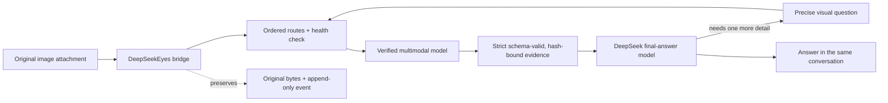

<p align="center">
  
</p>

<p align="center">
  
</p>

<h1 align="center">DeepSeekEyes</h1>

<p align="center"><strong>Give DeepSeek sight without leaving the conversation.</strong></p>

<p align="center">
  An auditable vision and cross-platform Computer Use runtime for
  <a href="https://github.com/deepseek-ai/deepseek-harness">DeepSeek Harness</a>.
</p>

<p align="center">
  <a href="README.zh-CN.md">简体中文</a> ·
  <a href="#quick-start">Quick start</a> ·
  <a href="#how-it-works">How it works</a> ·
  <a href="#computer-use">Computer Use</a> ·
  <a href="#token-accounting">Token accounting</a> ·
  <a href="https://x.com/lucars2026">X / @lucars2026</a>
</p>

<p align="center">
  <a href="https://x.com/lucars2026"></a>
  <a href="https://github.com/dttxorg/deepseekeyes/releases/latest"></a>
  <a href="https://www.npmjs.com/package/@dttxorg/deepseekeyes"></a>
  <a href="https://github.com/dttxorg/deepseekeyes/actions/workflows/ci.yml"></a>
  
  = 22.19" />
  <a href="LICENSE"></a>
</p>

DeepSeek's strongest text models can reason about code, documents and interfaces, but they do not consume image pixels. **DeepSeekEyes is the DSH runtime that makes those pixels auditable:** it selects and health-checks visual routes, validates every nested evidence field, binds evidence to original bytes, records failover, and keeps DeepSeek as the reasoning model.

No window switching. No manual transcription. No lossy screenshot relay.

This is not another captioning window. It is the **DSH auditable vision and Computer Use runtime** for image evidence, Browser automation and native Windows/macOS control.

## Why DeepSeekEyes

| Requirement | What DeepSeekEyes does |
| :-- | :-- |
| **One conversation** | Image → vision evidence → DeepSeek reasoning → optional visual follow-up all happen inside the current Harness task. |
| **Original pixels stay authoritative** | User images are not resized, converted or recompressed. Every reread references the original content-addressed attachment. |
| **The models can communicate** | DeepSeek can request a precise region or detail instead of depending on one oversized first description. |
| **No surprise text overhead** | Pure-text turns keep the direct model path: no visual call, no Computer Use tool and no DeepSeekEyes usage entry. |
| **The eye is verified** | Static image-capability metadata is followed by an optional randomized 3×3 pixel probe. A text-only model cannot silently pose as the eye. |
| **Routes fail over visibly** | Ordered visual routes, health TTL, circuit cooldown and bounded attempts are persisted without prompt/image contents. |
| **Evidence is a contract** | One public JSON Schema drives prompts and Ajv validation; unknown or malformed nested fields stop the route. |
| **Automation is built in** | Browser Computer Use plus native Windows/macOS desktop control can observe, act, verify and preserve evidence. |
| **Usage is visible** | The native settings card separates exact Provider usage, estimated bridge input and normal final-answer usage. |

## Quick start

### 1. Install, upgrade or diagnose

```bash
npx -y @dttxorg/deepseekeyes@latest install
npx -y @dttxorg/deepseekeyes@latest upgrade
npx -y @dttxorg/deepseekeyes@latest doctor
```

These commands work in macOS/Linux shells and Windows PowerShell. Use `--profile NAME` when the DSH profile is not `web`. Restart `dsh web` once after installation or upgrade.

### 2. Configure entirely in Harness

1. Open **Settings → Models** and add the text Provider/model and multimodal Provider/model you already use.
2. Open **Settings → Plugins → DeepSeekEyes**.
3. Select:
   - **Final answer Provider + model** — the DeepSeek model that reasons and replies;
   - **Background vision Provider + model** — the multimodal model that reads pixels.
4. Keep the randomized pixel probe enabled for the first real image.
5. Save, then select the `DeepSeekEyes` model entry in the conversation model picker.

Custom OpenAI-compatible gateways can be declared image-capable from the same card; the plugin writes the exact Harness `defaultInput: [text, image]` setting without replacing sibling Provider fields.

### 3. Paste an image

Ask normally:

> Read this screenshot, identify the failure, and tell me the next action.

DeepSeekEyes automatically reads the new image, gives DeepSeek structured evidence, and preserves the original for later targeted questions.

## How it works



The first read is deliberately not the end of the visual conversation. DeepSeek may emit a bounded private clarification request naming the image SHA-256, one exact question and an optional normalized region. The eye rereads the original pixels and returns targeted evidence; DeepSeek then continues reasoning.

Historical images are compacted into bounded SHA-256 pointers. They cause no automatic reread, but the session-scoped `deepseekeyes_look` tool can recover one preserved original on demand—even after switching to a native text-only model.

## Capability matrix

| Capability | Status | Notes |
| :-- | :--: | :-- |
| Native pasted-image bridge | ✅ | Original Harness attachment stays in the append-only session log. |
| DeepSeek ↔ vision clarification | ✅ | Bounded, precise questions against the same original image. |
| Vision-model capability probe | ✅ | Metadata gate plus randomized pixel test. |
| Canonical evidence JSON Schema | ✅ | One source drives prompts and rejects invalid nested fields. |
| Route health and failover audit | ✅ | Priority, health TTL, circuit cooldown and bounded attempts. |
| Custom multimodal gateways | ✅ | OpenAI-compatible routes can be declared from the GUI. |
| Browser Computer Use | ✅ | Open, observe, click, type, select, wait, assert, report and close. |
| Windows desktop Computer Use | ✅ | PowerShell + native user32/System.Drawing helper. |
| macOS desktop Computer Use | ✅ | JXA + CoreGraphics/System Events/screencapture helper. |
| Lossless oversized screenshots | ✅ | Recompressed without pixel changes, then tiled only when the Host's 5 MB limit requires it. |
| Local Token accounting | ✅ | Exact Provider usage plus clearly labelled bridge estimates. |
| Public visual eval | ✅ | Screenshot, dense text, chart, UI and prompt-injection cases with accuracy/latency/Token output. |
| Pure-text isolation | ✅ | No visual call, screenshot or Computer Use prompt when none is needed. |

## Computer Use

Both automation modes are **off by default** and are enabled independently from **Settings → Plugins → DeepSeekEyes**.

### Browser Computer Use

The Playwright-powered browser loop returns a fresh screenshot and semantic element references after every action. Mutations require the latest `stateId`, stale actions are rejected, and an assertion/report loop turns the same feature into an automatic test runner.

Supported operations include navigation, observation, click, type, select, check, keyboard input, wait, visual assertions, evidence reports and session close.

### Windows / macOS Desktop Computer Use

The native `computer` tool can:

- observe the current display and window catalog;
- move, click and drag the pointer;
- type Unicode text and keyboard shortcuts;
- scroll, wait, launch and focus applications;
- move, resize and close windows;
- run visual assertions and save evidence reports.

Every action is bound to the newest screenshot state and returns another full-screen PNG through the same visual bridge. Native Desktop Computer Use is implemented for Windows and macOS; Browser Computer Use remains available wherever the configured Chromium runtime is available.

## Token accounting

The native plugin card exposes **Token usage statistics** without making a statistics model call.

| Counter | Meaning |
| :-- | :-- |
| **Exact additional Tokens** | Provider-reported pixel probe, initial read, targeted reread and DeepSeek visual-clarification rounds. |
| **Estimated bridge input** | Evidence/protocol/tool text injected by the plugin, estimated with the Harness fixed-density rule. |
| **Estimated plugin total** | Exact additional usage plus estimated bridge input. |
| **Final model visual-turn usage** | Recorded separately and excluded from plugin overhead, so DeepSeek's normal answer is not charged to the plugin. |
| **Operational counters** | Visual turns, original-image rereads and vision-cache hits. |

Statistics refresh/reset uses the loopback-only `/deepseekeyes` RPC. Data is atomically stored at `$DSH_HOME/deepseekeyes/usage-stats.json` with mode `0600` and a 50-session detail limit. A temporary write failure keeps counting in memory and does not interrupt the user's turn.

Disable collection in the GUI or use:

```bash
export DEEPSEEKEYES_USAGE_STATS=false
```

## Data integrity by design

- User images pass through `ctx.attachments.readImage()` as the original Harness `ImageBlock`.
- Original MIME type, byte length, dimensions and SHA-256 are recorded with the evidence.
- Visual evidence is validated against the public [`schemas/visual-evidence.schema.json`](schemas/visual-evidence.schema.json) before DeepSeek sees it; every nested object rejects extra fields.
- A targeted reread references original pixels—not a thumbnail, JPEG copy or summary of a summary.
- Failed vision calls, invalid evidence or exhausted clarification bounds stop the visual turn instead of inviting a guess.
- Browser/Desktop screenshots carry content-addressed state and stale-action protection.
- Typed text and launch arguments are hashed in persisted Computer Use reports.

## Configuration reference

The common route and automation settings are available in the GUI. Headless deployments may use the same fields in `cordis.patch.yml` or environment variables.

| Area | Important fields |
| :-- | :-- |
| Model routing | `upstreamProvider`, `upstreamModel`, `visionProvider`, `visionModel` |
| Vision validation | `autoDetectVision`, `activeProbe`, `maxClarifications` |
| Route reliability | `visionRoutePriority`, `visionHealthCheck`, `visionFailoverAttempts`, health TTL/cooldown and attempt retention |
| Visual budgets | `baseMaxTokens`, `targetMaxTokens` — `0` delegates the limit to the Provider |
| History bounds | `historyImageLimit`, `historySummaryChars`, `browserHistoryLimit`, `desktopHistoryLimit` |
| Browser | `browserComputerUse`, channel/executable, viewport, timeout and observation bounds |
| Desktop | `desktopComputerUse`, timeout, settle delay, display, PowerShell and evidence directory |
| Usage | `usageStats`, `usageStatsPath` |

See the [complete Chinese configuration reference](README.zh-CN.md#配置字段) for every field and default.

## Verification

```bash
npm ci
npm run check
npm run eval:fixture
npm run test:coverage
npm run test:browser
npm run test:desktop
npm audit --omit=dev
```

The release is continuously checked on Ubuntu, macOS and Windows. Native helper parsing/compilation and desktop observation run on their respective CI hosts.

Run a real multimodal Provider against the public suite with `npm run eval:live`; see [`evals/README.md`](evals/README.md). The committed fixture-oracle result validates 5 cases and 30 assertions while remaining explicitly separate from a model benchmark.

## Runtime documentation

- [Architecture and failure semantics](docs/architecture.md)
- [Data retention and deletion](docs/data-retention.md)
- [Release and npm provenance](docs/releasing.md)
- [Security policy](SECURITY.md)
- [Troubleshooting and doctor](TROUBLESHOOTING.md)
- [Public visual eval](evals/README.md)

## Community

Built something with DeepSeekEyes, found an edge case, or want a new Computer Use action?

- Open a [GitHub issue](https://github.com/dttxorg/deepseekeyes/issues).
- Follow and message **[@lucars2026 on X](https://x.com/lucars2026)** for release notes and project updates.
- Star the repository if the bridge saves you a window switch—the next developer will find it faster.

## License

[MIT](LICENSE)
