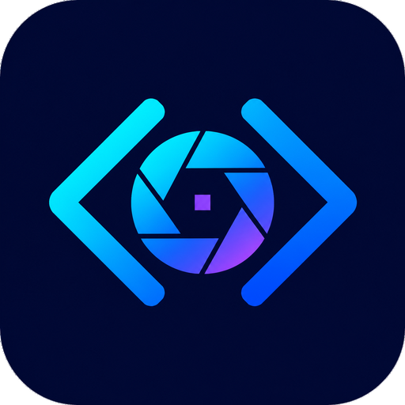
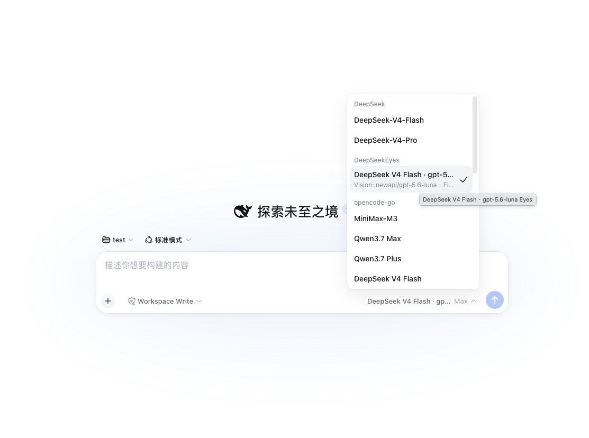
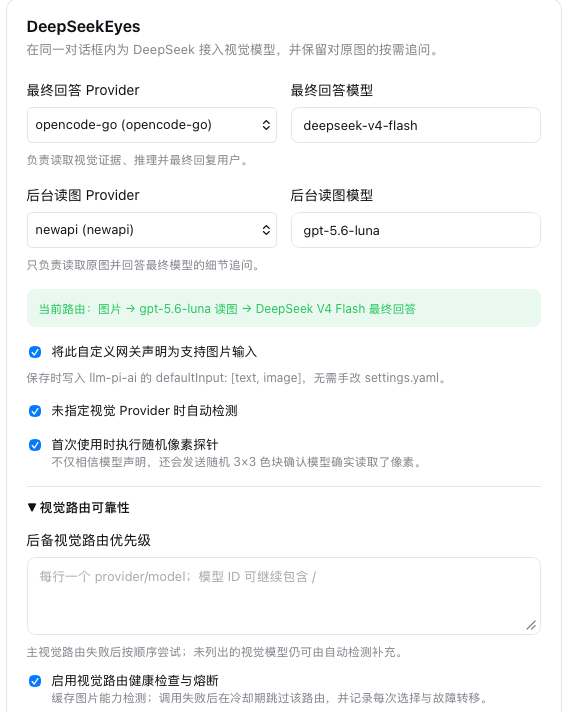
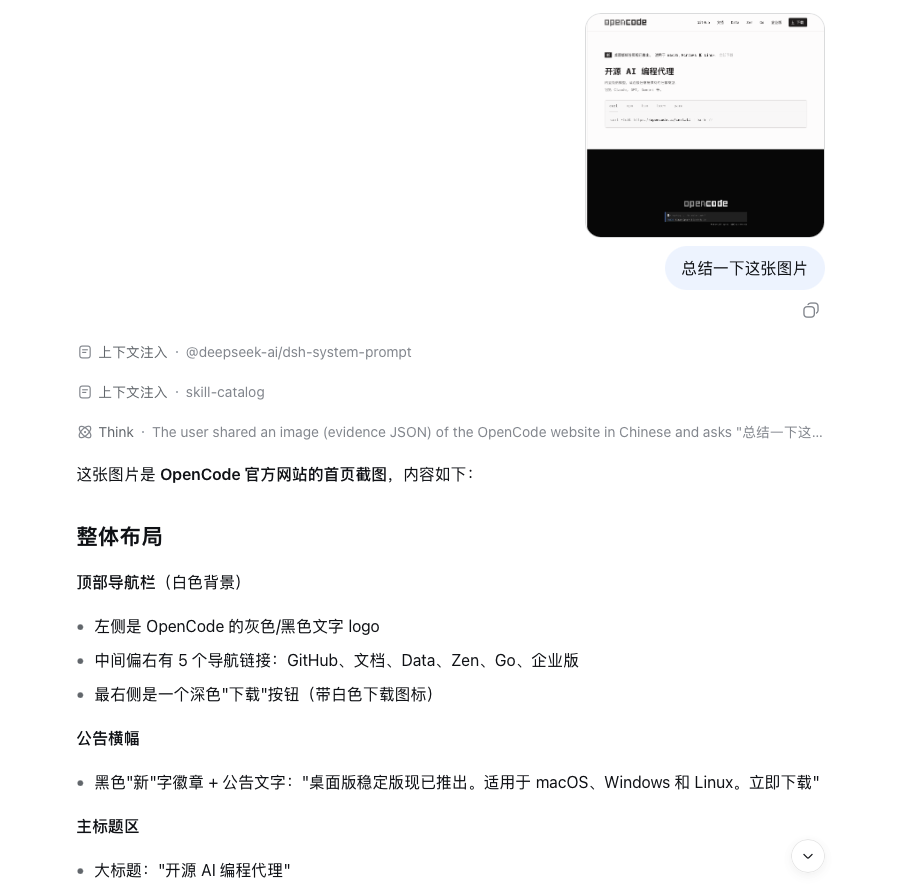
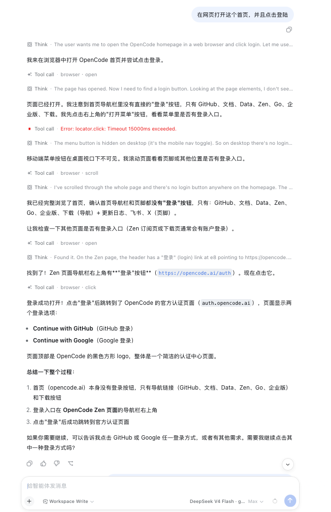

<p align="center">
  
</p>

<p align="center">
  
</p>

<h1 align="center">DeepSeekEyes</h1>

<p align="center"><strong>让 DeepSeek 看见，而且全程不离开当前对话。</strong></p>

<p align="center">面向 DeepSeek Harness 的可审计视觉、MCP 与 Windows / macOS Computer Use Runtime。</p>

<p align="center">
  <a href="README.md">English</a> ·
  <a href="#实机能力展示">实机能力</a> ·
  <a href="#安装升级与-doctor">快速安装</a> ·
  <a href="#工作方式">工作方式</a> ·
  <a href="#windows--macos-desktop-computer-use-058默认关闭">Computer Use</a> ·
  <a href="#mcp-应用执行层-07默认关闭">MCP 应用</a> ·
  <a href="#本插件-token-消耗统计">Token 统计</a> ·
  <a href="#配置字段">完整配置</a> ·
  <a href="https://x.com/lucars2026">X / @lucars2026</a>
</p>

<p align="center">
  <a href="https://x.com/lucars2026"></a>
  <a href="https://github.com/dttxorg/deepseekeyes/releases/latest"></a>
  <a href="https://www.npmjs.com/package/@dttxorg/deepseekeyes"></a>
  <a href="https://github.com/dttxorg/deepseekeyes/actions/workflows/ci.yml"></a>
  
  
  <a href="LICENSE"></a>
</p>

DeepSeekEyes 不是另一个看图窗口，而是 **DSH 可审计视觉、Computer Use 与 MCP 应用执行 Runtime**。它负责视觉路由排序、健康检查、严格证据 Schema、原图身份、结构化应用调用、故障转移记录和自动化状态；DeepSeek 继续负责推理与最终回答。

**不切窗口、不手工抄图、不把缩略图当原图，也不让普通纯文字会话承担视觉插件开销。**

## 实机能力展示

下面四张图均来自 DeepSeek Harness 的真实运行界面，不是概念图，展示识图与 Browser 两条闭环；MCP 工具闭环在下文单独说明：

- **识图闭环：**粘贴图片 → 后台多模态模型读取原始像素 → 严格证据交给 DeepSeek → DeepSeek 在当前对话完成总结，并可继续按区域追问原图。
- **浏览器控制闭环：**提出网页任务 → Browser Computer Use 打开、观察、滚动和点击 → 每步返回新截图与状态 → DeepSeek 验证结果；目标不存在时也可以根据真实页面重新规划路径。
- **结构化应用闭环（下文说明）：**启用 MCP Server 并只选择所需 Tools → DeepSeek 后台调用 → DeepSeekEyes 对结果限长、哈希和审计 → DeepSeek 根据返回值或读取回查验证目标状态。

<table>
  <tr>
    <td width="50%" valign="top">
      <strong>一个可直接选择的 DeepSeekEyes 路由</strong><br />
      <sub>模型选择器会把最终回答模型与后台 “Eyes” 视觉模型组合成一个明确入口，不需要切换对话窗口。</sub><br /><br />
      
    </td>
    <td width="50%" valign="top">
      <strong>在 Harness 原生设置中配置视觉路由</strong><br />
      <sub>分别选择最终回答与后台读图 Provider/模型，实时核对路由，并启用自动能力检测、随机像素探针、健康检查与故障转移。</sub><br /><br />
      
    </td>
  </tr>
  <tr>
    <td width="50%" valign="top">
      <strong>在当前对话直接识别粘贴图片</strong><br />
      <sub>图片留在原任务中，DeepSeek 根据视觉证据识别网页布局、导航、文字与界面元素并输出结构化总结。</sub><br /><br />
      
    </td>
    <td width="50%" valign="top">
      <strong>控制浏览器并验证结果</strong><br />
      <sub>Agent 打开网站、读取真实页面、滚动、选择正确导航路径、点击登录，并确认最终到达认证页面。</sub><br /><br />
      
    </td>
  </tr>
</table>

## 一眼看懂

| 你关心的问题 | DeepSeekEyes 的处理方式 |
| :-- | :-- |
| 图片会不会在转交时失真？ | 用户原图不缩放、不转格式、不重压；每次追问重新引用原始内容寻址附件。 |
| DSH 原生视觉会不会重复扣两次？ | 在 rc.8+ 中，最终模型显式声明图片输入时，插件直接把原始 `ImageBlock` 交给它并跳过后台视觉模型，同时单独记录“原生视觉旁路轮次”。 |
| 第一次视觉描述不够怎么办？ | DeepSeek 可以携带图片 SHA-256、精确问题和可选区域继续向视觉模型追问。 |
| 视觉模型选错了怎么办？ | 先检查图片能力声明，再通过随机 3×3 色块探针验证它确实读取了像素。 |
| 主视觉模型出错怎么办？ | 按配置优先级执行有界故障转移，失败路由进入冷却期，每次 attempts 都写入本地审计记录。 |
| 视觉模型输出不完全一致怎么办？ | 推理前缀、多 JSON 候选、缺失空列表及常见数值/bbox 格式先在本地确定性规范化并记录审计，最终仍由同一份公开 JSON Schema 严格校验。 |
| 会不会影响正常文字对话？ | 默认关闭 Computer Use 与 MCP 时，纯文字轮次走原有直通路径，不读图、不截图、不携带工具 Schema。显式暴露 MCP 工具后，Schema/结果成本会单独估算并展示。 |
| 能否自动测试网页和桌面？ | Browser Computer Use 与 Windows/macOS 原生 Desktop Computer Use 均已实现，且默认关闭、按需启用。 |
| 插件到底用了多少 Token？ | 设置卡会把 Browser/Desktop/MCP 工具引发的每次 DeepSeek 调用计入插件额外用量，并分别展示 MCP Schema/结果估算、上下文保护次数和估算避免重放的输入。 |

## 工作方式

```text
同一对话框中的图片和问题
  → Harness 原始内容寻址附件
  → 已排序的视觉路由、健康检查与像素探针
  → 严格 Schema 验证的 OCR、布局、对象、关系和不确定性证据
  → DeepSeek
  → 可选的内部细节追问
  → 视觉模型重新读取同一原图
  → DeepSeek 最终回答
```

插件不保存 API Key，也不实现另一套供应商客户端。视觉调用全部经过 `ctx.llm`，因此直接复用 Harness 模型页面已经配置的端点、模型和凭据。

当最终回答模型本身已经声明 `inputModalities: [text, image]` 时，DeepSeekEyes 会自动进入**原生视觉旁路**：本轮原始 `ImageBlock` 直接交给该模型，模型选择器显示 `Native Vision`，不再调用第二个视觉模型，也不注入证据提示。回答结束后，插件只把后续模型可见的会话表面替换成有界的 SHA-256 附件引用；追加式原始事件和附件字节保持不变。Token 面板会增加“原生视觉旁路轮次”，而这条路径的视觉模型 Token、估算桥接输入和精确插件额外 Token 均保持为零。

## 可审计视觉路由与严格 Schema（0.4）

视觉路由按“当前证据原路由 → GUI 主路由 → `visionRoutePriority` → 自动检测”排序。图片能力健康检查默认缓存 60 秒；调用失败后该路由默认冷却 30 秒，并在替代路由存在时被跳过。每次健康检查、失败、缓存命中、跳过和成功都会记录到：

```text
$DSH_HOME/deepseekeyes/vision-attempts.json
```

记录只包含 Provider、模型、阶段、状态、耗时、错误码、图片 SHA-256 和哈希后的会话 ID，不写入图片、提示或模型证据正文。

基础读取与细节读取共同使用 [`schemas/visual-evidence.schema.json`](schemas/visual-evidence.schema.json)。提示中的紧凑 JSON 示例由这份 Schema 自动生成，最终结果仍由 Ajv 按同一来源严格验证。0.5.5 能从 MiniMax 一类可见推理前缀或多个平衡 JSON 候选中选择最后一个匹配证据对象；缺失的空列表、字符串数值、百分比 confidence 和对象式 bbox 会在本地确定性规范化，并逐字段记录 `structuralCanonicalization` 审计。常见的归一化/像素 `xywh`、归一化/像素 `xyxy` 与 Qwen 0–1000 `xyxy` 继续保留原坐标审计。整个修复不增加“修复模型”调用，也不改变原图；额外字段和无法确定修复的内容仍会让当前路由失败并进入有界 failover。

遇到 Anthropic SSE `content_block_delta` 提前结束、`Unexpected end of JSON input` 这一类明确的瞬时流错误时，同一路由最多重试一次；该 retry 会写入 attempts，且前后两次 Provider 已返回的 Token 都计入统计。内容或 Schema 错误不会触发这种传输重试。

## 原生模型切换与按需重新看图

视觉读取成功后，0.2 及后续版本会把**模型可见的会话表面**中的图片块替换为一个短小的保留记录，其中只包含原图 SHA-256、附件引用、尺寸和有界摘要；原始图片事件与附件字节仍完整保存在 Harness 的追加式会话日志和附件存储中。

因此，同一个会话可以直接从 `DeepSeekEyes → DeepSeek V4 Flash · Eyes` 切换到原生 `DeepSeek V4 Flash`，不会再触发：

```text
Model "deepseek-v4-flash" does not accept image input,
but this session already contains images
```

处理过图片的会话会获得仅对该会话生效的 `deepseekeyes_look` 工具。原生文本模型只有在当前问题确实需要摘要中缺失的视觉事实时，才用图片 SHA-256 和一个精确问题重新读取原始附件；普通文本问题不会调用视觉模型。没有处理过图片的会话不会注册这个工具，也不会增加对应系统提示。

历史图片不会在后续文本轮次中自动重复读图。插件默认只向最终模型保留最近 8 个短图片引用，每个摘要最多 320 字符；其余原图仍保存在会话和附件存储中，可按需重新读取。

## Browser Computer Use 0.2（默认关闭）

在设置中明确启用后，0.2 在同一 Harness 对话中注册 `browser` 工具，形成闭环：

```text
打开网页 → 返回 DOM 与截图 → DeepSeekEyes 读取截图
→ DeepSeek 选择最新控件 → 点击、输入或滚动 → 自动返回新截图
→ 断言页面状态 → 继续操作 → 生成 JSON 测试报告
```

每次操作都会返回当前 URL、标题、页面文字、可交互控件 `ref`、边界框、视口、最新截图、诊断信息和新的 `stateId`。点击、输入、选择、断言等状态相关动作必须携带最新 `stateId`；旧状态会返回 `STALE_BROWSER_STATE`，且页面保持在当前状态。

支持的动作包括：`open`、`observe`、`click`、`type`、`press`、`select`、`check`、`uncheck`、`scroll`、`wait`、`assert`、`back`、`forward`、`reload`、`report` 和 `close`。优先使用最新 `ref`、role/name 或 CSS selector；Canvas 等自绘控件可使用当前截图视口内的坐标。

每一步截图和最终报告默认保存到：

```text
$DSH_HOME/deepseekeyes/browser-runs/<run-id>/
```

动作记录只保存输入长度和 SHA-256，不写入填写内容原文。报告只有在全部断言通过且此前没有动作错误时才标记为通过。

Browser Computer Use 默认关闭，普通图文桥接和纯文本会话不会携带 `browser` 工具或相关系统提示。启用后，只有最新 Browser 状态保留完整 DOM/OCR/截图证据；历史状态默认只保留最近 8 个紧凑摘要，避免每一步把此前的完整页面证据再次发送给模型。

从 0.5.7 起，Browser/Desktop 工具轮次还共用一层自动化 Token 保护：提交给 DeepSeek 的模型副本默认最多约 32,768 Token，只保留最新直接用户指令以及成对的最新工具调用/结果；完整 Harness 任务、事件、截图与报告不删除。一个用户指令默认最多触发 32 次最终模型调用，达到上限后等待新的用户指令。两个值均可自定义，`0` 表示明确不限制。

## Windows / macOS Desktop Computer Use 0.5.8（默认关闭）

0.5 把原有桌面控制推进为“截图 + 原生语义 + 状态差分”的闭环。它保持 [OpenAI 官方 Computer use 文档](https://developers.openai.com/api/docs/guides/tools-computer-use)描述的核心循环：观察当前 UI、执行结构化动作、捕获新状态、基于结果继续；同时复用 Windows UI Automation 与 macOS Accessibility，减少只靠全屏像素猜控件的位置：

```text
observe(scope=desktop) 发现窗口
→ observe(scope=window) 获取目标窗口截图和语义控件
→ DeepSeekEyes 优先判断语义状态是否已经足够
→ DeepSeek 使用最新 stateId + elementRef（或截图坐标）执行动作
→ 原生 Helper 操作桌面
→ 无损保存新截图，返回控件树、stateDelta、stateId 和 visualDelivery
→ 运行时断言或视觉断言验证结果并继续
```

支持：`observe`、`click`、`double_click`、`right_click`、`move_cursor`、`drag`、`type`、`key`、`scroll`、`invoke`、`set_value`、`perform_action`、`launch`、`focus`、`move_window`、`resize_window`、`close_window`、`wait`、`assert`、`report` 和 `close`。

`launch` 可以直接调用，不需要先 `observe` 或提交 `stateId`。macOS 的 `application` 可填写显示名称（包括应用改名前的可解析别名）、Bundle ID 或完整 `.app` 路径；例如 `ChatGPT`、`Codex`、`com.openai.codex`、`/Applications/ChatGPT.app` 均会解析到实际安装的应用。按 `application` / `title` 聚焦同样不依赖旧截图。

从 0.5.8 起，桌面文字输入不再信任“碰巧拥有键盘焦点的控件”。视觉模型负责在本次交付的准确截图中定位像素目标和模态框，DeepSeek 负责规划与生成文字，原生执行器负责一次性完成：聚焦目标窗口 → 点击/聚焦目标控件 → 验证前台窗口与模态状态 → 输入 → 重新截图。`type` 必须提供 `elementRef`，或提供完整 `x/y`；坐标输入还会绑定 `windowRef` 或最近一次窗口级观察。只传 `text` 会在系统输入前被拒绝，只有显式设置 `allowFocusedTarget: true` 才进入兼容路径。

出现 `TARGET_FOCUS_MISMATCH`、`DESKTOP_MODAL_TARGET_BLOCKED`、`DESKTOP_COORDINATE_SPACE_MISMATCH` 或 `DESKTOP_TYPE_COORDINATE_OUTSIDE_WINDOW` 时，表示文字尚未发送。此时重新观察、先处理模态框或让视觉模型在新截图中重新定位，再携带新 `stateId` 重试。Windows 使用窗口聚焦、原子点击和 `SendInput`；macOS 的语义控件优先通过 Accessibility 当前选区插入文字，纯坐标 Unicode 输入使用完整剪贴板 item/type 保存—粘贴—恢复事务。

运行时可以直接验证 `window_exists`、`window_title_contains`、`element_exists/visible/hidden/enabled/disabled/focused`、`element_value_equals`、`element_name_contains`、`screen_changed/unchanged`；像游戏、Canvas 和自绘界面仍使用 `visual` 断言。最终 `report` 使用 `deepseekeyes.desktop-report.v2` 汇总动作、断言、每步状态差分和截图身份。

- 未知目标先使用 `observe`；`launch` 以及按名称聚焦可直接执行，会改变桌面或使用 ref 的其他动作必须提交最新 `stateId`。
- 坐标绑定最新截图像素，越界坐标在调用系统接口前被拒绝。
- `windowRef` / `elementRef` 从原生身份生成；同一对象跨观察保持稳定。只读 `observe` 可直接复用当前 `windowRef`，所有 ref 变更动作仍必须携带同一次最新结果的 `stateId`，避免对过期界面执行操作。
- 每个结果都会返回 `semanticStatus`。macOS 会优先选择当前聚焦/主窗口及可用尺寸窗口，而不是应用列表中的微型辅助窗；Accessibility 控件同时受 `desktopMaxElements` 和 Helper 时间预算约束，状态会给出 `truncated`、`limitReason` 与耗时，不再为 Electron 的完整控件树阻塞到超时。当状态为 `sparse`、`empty` 或 `disabled` 时，模型会立即改用当前无损截图坐标，而不是反复查询缺失控件。
- 默认 `desktopVisualMode: auto`：完整语义观察和已确认成功的动作直接走文本快路径，**不会调用视觉模型**。`observe`、`launch`、`wait` 遇到稀疏/空/关闭的语义树时仍自动交付像素；任意动作也可显式传入 `includeScreenshot: true`。`always` 保留逐步完整读图审计，`manual` 只响应显式读图请求。
- 无论本轮是否把像素交给模型，每一步都会捕获并保存完整无损 PNG；省略图片块只减少模型调用，不删除、不缩放、不转码原始截图。运行时会读取当前 Harness 的单图字节、单边尺寸、解码像素、图片数量和总字节限制；即使 5K/超宽屏 PNG 压缩后小于 5 MB，只要单边超过 Host 上限也会按坐标无损分块，不再把整张超宽图交给附件层后报错。结果中的 `visualDelivery` 会说明是否读图及原因，`timings` 会列出原生往返、语义收集、截图处理和工具总耗时。
- 已知目标默认继续返回窗口级截图；`scope=desktop` 可显式回到全桌面发现。窗口截图坐标以返回图片左上角为原点，Helper 会映射回系统全局坐标。
- Windows 通过 PowerShell、UI Automation、`user32`、`SendInput` 和 `System.Drawing` 控制与截图；macOS 通过 JXA、Accessibility、CoreGraphics、System Events 和 `screencapture` 完成同一闭环。
- Windows PowerShell 5.1 的输入/输出固定为 UTF-8；点击、拖动与移动坐标先把最新截图原点和相对坐标强制转成标量，再调用 `user32`。因此负坐标/多显示器/窗口级截图不会再触发 `[System.Object[]] op_Addition`，且本地化错误信息保持可读。
- 输入文本、`set_value` 的值和启动参数只在报告中保存长度和 SHA-256，不保存原文；macOS 坐标输入完成后会恢复粘贴前的全部剪贴板 item/type。
- `stateDelta` 按完整像素哈希判断截图变化，并分别记录窗口与控件的 added/removed/changed，避免 PNG 编码变化被误判为 UI 变化。
- 每一步原始 PNG 和最终 JSON 报告默认写入 `$DSH_HOME/deepseekeyes/desktop-runs/`。

Harness 同时存在单图字节、单边尺寸、解码像素、图片数量和消息总字节边界。桌面截图先做**像素无损** PNG 重压，再针对当前 Host 返回的全部边界按明确的 `x/y/width/height` 坐标拆成无损 PNG 图块，在同一次工具结果中交给视觉桥接。该过程不缩放、不转 JPEG；状态同时记录原始 PNG SHA-256、完整像素 SHA-256、每块像素 SHA-256 和附件 SHA-256。配置证据目录时，原始编码 PNG 也会完整保留。

Desktop Computer Use 默认关闭。关闭时不会注册 `computer` 工具或桌面系统提示，也不会截图、调用视觉模型或增加普通对话的 Token 开销。启用后的默认自动模式只在像素确实必要时读图；历史桌面状态独立按 `desktopHistoryLimit` 压缩，默认只保留最近 8 个短摘要，不重复携带旧截图和完整窗口列表。

自动模式虽然能省去视觉模型调用，但每个动作之后仍需要 DeepSeek 决定下一步。因此 0.5.7 会在语义快路径和读图路径上统一限制自动化上下文与单指令调用次数，避免在已有几十万 Token 的长会话中把整段历史反复提交。普通文字轮次和非 Computer Use 图片轮次不进入该限制。

macOS 第一次使用需要在 **系统设置 → 隐私与安全性** 中，为启动 `dsh web` 的终端授予**屏幕录制**和**辅助功能**权限。Windows 不需要安装浏览器自动化组件；如系统的 PowerShell 不在默认路径，可在插件设置卡中填写完整路径。

## MCP 应用执行层 0.8.1（默认关闭）

DSH 已包含底层 MCP Client，但默认没有连接任何 Server，也没有完整的 Content 设置界面。DeepSeekEyes 0.8 从 DSH 管理的 `$DSH_HOME/profiles/node_modules` Host fallback 解析官方 `@deepseek-ai/dsh-mcp-client`、匹配的 `@deepseek-ai/dsh-tools` 以及该 Host Client 自己依赖的协议 SDK，并将入口 canonicalize 到 Host 真实安装路径；插件不会再打包第二份 MCP SDK。普通 Tools 继续完全走官方 DSH Client，启用 OAuth 的 Streamable HTTP Server 则使用同一 Host SDK 的 OAuth transport 适配器；Resources 与 Prompts 进入独立、显式启用的 Content Plane。即使同一 profile 里有其他插件带入同名副本，也不会拆分 Cordis 服务和工具调度器身份。原生设置卡里补齐了可直接使用的 **MCP 应用与工具**控制中心：

- 增删、启停本机 `stdio` 或远端 `Streamable HTTP` Server；远端必须使用 `https://`，只有 `localhost`、`127.0.0.1`、`[::1]` 等显式 loopback 主机/地址可以使用 `http://`；
- 分别测试真实 Tools 与 Content transport 往返、查看两条平面各自的健康状态/延迟/最近错误、强制新 transport generation 刷新并重新连接；状态轮询在 30 秒内复用各平面的已验证结果，过期后只发起一个共享探针批次，不把旧目录缓存当健康；
- 凭据只保存**环境变量引用**：stdio 的 `env` 与 Streamable HTTP 请求头只填写 `dsh web` 进程环境中的变量名；明文 Token、含凭据的启动参数与 URL 会被拒绝；
- Streamable HTTP 可选启用 **OAuth 2.0 Client Credentials**：Host MCP SDK 自动发现 Protected Resource Metadata（RFC 9728）与 Authorization Server Metadata（RFC 8414/OIDC fallback）；Client ID/Secret 只填写环境变量名，默认使用 `client_secret_basic`，也可选择 `client_secret_post`；访问 Token 仅保留在当前进程内；
- 同一 OAuth Server 的 Tools 与 Content 共用一份内存 OAuth provider 和 Bearer 生命周期。Token 过期、刷新、发现或传输失败会进入 MCP 健康快照和隐私降级审计，不返回凭据或 Token 原文；未启用 OAuth 的普通 MCP、视觉、Browser、Desktop 和文字路径保持原有调用与 Token 行为；
- 无界面部署可直接参考 [`examples/mcp-oauth.patch.yml`](examples/mcp-oauth.patch.yml)；GUI 与该示例使用同一套严格校验。
- 新 Server 的工具允许列表默认为空，只有明确选择的工具才会注册给模型；拒绝规则始终优先于允许规则；
- 每个 Server 可选择“允许已选工具”或“仅允许只读工具”风险策略。只读策略会在 Schema 暴露前排除 `write`、`destructive` 与 `unknown-write`，并在执行入口再次校验；过期/直接调用会以 `MCP_TOOL_RISK_BLOCKED` 停止，不接触外部 Server；默认策略保持兼容行为；
- 只修改 allow/deny 时会原地更新适配器策略，不重复建立 MCP 传输；需要重新读取原始名称/注解时，刷新期间会先撤回 Schema，失败的元数据清理句柄会保留到后续关闭重试；
- 每个 Server 可独立启用 Tools、Resources 和 Prompts。Tools 为兼容旧配置默认开启；Resources/Prompts 默认关闭，关闭时 **不建立 Content 连接、不增加通用 Schema，也不触发模型调用**；
- Resources、Resource Templates 与 Prompts 的发现目录共享固定上限：最多 256 条、256 页、1,000,000 字符、4,000,000 字节；三类 allowlist 均默认空，deny 始终优先；
- 只有至少一个发现项被明确允许时，才暴露两个有界通用工具：`mcp__deepseekeyes__resource` 与 `mcp__deepseekeyes__prompt`。目录内容不会整批写进系统提示；
- Prompt 名称、已声明参数、必填参数和字符串类型会在 transport 前验证；Resource 必须是已发现的精确 URI，或匹配已发现且已允许的 URI Template；
- 持久 capture catalog 超过 256 Tools、1,000,000 个测量 Schema 字符、4,000,000 个 UTF-8 Schema 字节、Schema 深度 64 或 100,000 个 Schema 节点时，整个 generation 原子拒绝，不保留部分目录；已有非空 generation 突然变成零工具时先撤销暴露并标为未验证，只有匹配的实时探针才能确认“健康的零工具”；
- capture 之后再应用独立的 `mcpMaxTools` 暴露预算与 Schema Token 估算；总预算超限的 allowlisted 工具不会进入模型请求，提高暴露预算也不会放宽固定 catalog 上限；
- MCP Schema 与系统提示只在 DeepSeekEyes 虚拟 Provider 的提示装配中保留；普通 Provider 会移除两者，错误 Provider 或无 Agent 作用域的直接执行还会在外部调用前再次拒绝；
- Code Mode 内层 MCP 调用通过 Harness Host 的 `deferContext()` 通道追加可信的插件 `mcp-context` 消息。每次成功或失败的子调用都携带紧凑状态/哈希标记；图片只携带不可变 Harness attachment 引用，不内联 base64。下一次模型继续因此会识别为 MCP 自动化并进入相同的上下文/调用次数保护与 `upstreamMcp` 统计。Native MCP 结果已经原生展示，不重复追加该上下文；Code Mode Host 缺少此通道时会在外部调用前以 `MCP_RESULT_CONTEXT_UNAVAILABLE` 失败；
- stop 或重新配置在等待异步清理前先暂停全部 MCP 暴露；Tools 与 Content 的清理失败会独立保留，受影响 Schema 持续撤销，重复探针/重连保持阻断，只有保留的 close handle 成功后才允许发布替代 generation；
- 每个成功 adapter 结果会在 DeepSeekEyes 规范化、base64 解码、附件写入和产物落盘**之前**经过固定硬准入：深度 64、节点 50,000、content blocks 4,096、非图片字符串合计 16 Mi 字符、图片 8 张、图片编码数据 28 MiB、图片解码数据 20 MiB、其他二进制数据 20 MiB；
- `mcpMaxResultChars` 只控制硬准入之后交给模型的 preview。通过准入的 adapter 值若过长或含非文本内容，默认把规范 JSON 按 SHA-256 私有落盘；POSIX 系统的 Server 目录/文件使用 `0700`/`0600`，Windows 则继承每用户 DSH Home 或显式产物目录的 ACL，因为 Node 返回的 POSIX mode 位不代表 NTFS 权限；写入或 rename 失败会拒绝该结果，并在不覆盖原始错误的前提下始终尝试清理临时文件；设置 `mcpArtifactDir: false` 后不会声称存在完整产物或引用，已交付图片会标为模型附件，未保留的原始 image/audio/resource block 会明确标为未保留；
- MCP 图片优先一次性提交给 Harness 的 `ctx.attachments.saveImages()`，由 Host 原子完成数量、总字节、媒体类型与图像解码准入；只有旧版 saveImage-only Host 才进入有界兼容路径，在逐张写入前先校验完整批次。返回的内容寻址附件再进入现有原图视觉证据与细节追问链。
- 错误审计只保留稳定/脱敏错误码与错误消息 SHA-256，不落盘错误消息原文。

有 MCP Server/API 的应用优先走结构化后台调用，通常不要求把窗口切到前台；没有 MCP 的网站继续走 Browser Computer Use，只有原生界面的应用继续走 Windows/macOS Desktop Computer Use。

每个已暴露工具的 Schema 即使尚未调用也会占用模型上下文。因此 MCP 默认关闭且初始没有 Server；新建 Server 的工具允许列表为空，不会暴露任何工具。设置页实时展示已选工具数及 Schema Token 估算。MCP 继续轮次还会进入现有的 32,768 Token 上下文保护与单指令调用次数保护，避免长任务历史反复提交。

Schema 估算按实际请求面计算：Native 模式计算原生函数定义，Code Mode 计算生成的 `tools:sdk` 声明，`both` 模式同时发送两者，因此估算值是这两个真实输入面的合计，而不是重复记账。

`automationMaxCallsPerTurn` 限制最终模型的继续请求；`mcpMaxExternalCallsPerRun` 另外限制单次 `run_code` 内的 MCP 子调用，默认 64 次，并在每次 transport dispatch 之前原子计数，下一次调用会以 `MCP_EXTERNAL_CALL_LIMIT_REACHED` 停止。显式设为 `0` 表示不限。ToolRuntime 并发与单次 timeout 仍是独立边界；高风险写操作 approval 仍由应用/Host 策略负责，因此应保持最小 allowlist、最小凭据并用读取工具回查写入结果。

首次连接顺序：添加 Server → 选择 Tools/Resources/Prompts 能力开关 → 只填写凭据的环境变量名 → 保存 → **测试连接** → 分别刷新工具或内容 → 只勾选任务所需的 Tool、Resource 与 Prompt → 再次保存 → 在对话中使用 `DeepSeekEyes` 路由。Server 连接成功不会自动暴露任何发现项。

0.8 覆盖 MCP **Tools、Resources、Resource Templates 与 Prompts** 的 stdio/Streamable HTTP 链路，以及非交互式 OAuth 2.0 Client Credentials；交互式 OAuth、Sampling/Elicitation、Roots 管理和通用后台 UI 驱动仍不属于本版本。后台操作要求目标应用提供兼容 MCP Server，并通过进程环境变量引用完成认证；没有 MCP Server 的应用仍使用 Browser/Desktop Computer Use。工具返回成功只是证据，不等于外部状态一定已改变；写操作后仍应检查有界结果，或再调用读取能力验证。

固定的原始结果准入位于依赖边界之后：已验证的官方 Host Client 与 MCP SDK 会先完成 transport 响应解码；只要响应的 `content` 是数组，Client 就会在检查 `isError` **之前**遍历内容块并拼接提取出的文本。成功路径随后丢弃这个临时字符串并返回内容块，失败路径则把它作为异常抛出。所以上述硬限制只约束依赖边界之后交给 DeepSeekEyes 的成功 adapter 值；插件会对已经生成的上游异常先限长、再脱敏后显示，但不宣称限制 SDK 更早的网络解码或这次准入前的提取/拼接分配。

目录准入也位于依赖边界之后：已验证的 Host Client 会先完整 drain/validate 全部 `tools/list` 分页并构建内存 definition Map，之后才逐项调用 DeepSeekEyes CaptureRegistry。固定 catalog 上限会原子限制插件随后持久 capture、排序与暴露的 generation，但不会前置限制单页网络响应字节、cursor 页数或 Client 的临时 pre-capture Map。

## 安装、升级与 doctor

macOS、Linux 和 Windows PowerShell 使用同一组一行命令：

```bash
npx -y @dttxorg/deepseekeyes@latest install
npx -y @dttxorg/deepseekeyes@latest upgrade
npx -y @dttxorg/deepseekeyes@latest doctor
```

非 `web` Profile 可追加 `--profile NAME`。安装或升级后重新启动一次 `dsh web`，然后在当前对话框的模型选择器中选择：

```text
DeepSeekEyes → 最终回答模型 · 后台读图模型 Eyes
```

此后图片仍按 Harness 原生附件方式粘贴，原始附件字节和追加式会话事件都保留，不需要在视觉模型窗口和 DeepSeek 窗口之间切换。

## 全 GUI 配置（0.8）

安装后只需重启一次 `dsh web`。此后的路由与插件参数都可以在 Harness 原生设置界面完成，保存后实时生效：

1. 打开 **设置 → 模型**，按 Harness 原有方式添加文本 Provider、视觉 Provider、模型和 API Key。
2. 打开 **设置 → 插件 → 可配置 → DeepSeekEyes**。
3. 分别选择两条明确路由：
   - **最终回答 Provider**；
   - **最终回答模型**（负责推理和回复用户）；
   - **后台读图 Provider**；
   - **后台读图模型**（只读取原图并回答细节追问）。
4. 在“视觉路由可靠性”中按行填写后备 `provider/model`，设置健康检查、故障转移次数、冷却期和 attempts 保留数量。
5. 选择是否自动检测、是否运行随机像素探针、追问轮数和 Token 档位。
6. 在 **Computer Use 0.5** 区域分别设置：
   - 自动化上下文上限（推荐 32,768）和每个用户指令最多模型调用（推荐 32）；两者都可自定义，`0` 为不限制；
   - Browser Computer Use 的启用状态、Edge/Chrome、无界面模式、视口和动作参数；
   - Windows/macOS Desktop Computer Use 的启用状态、截图交付策略、语义控件开关/上限、动作超时、稳定等待、窗口数、macOS 显示器编号、Windows PowerShell 路径和证据目录。
7. 在默认折叠的 **MCP 应用与工具**区域添加 Server，保存后测试连接，再只选择本任务需要的工具；不使用时保持关闭。
8. 先核对卡片里的实时摘要，例如 `图片 → MiniMax-M3 读图 → DeepSeek-V4-Pro 最终回答`，再点击 **保存并立即应用**。
9. 在对话模型选择器中选择 `DeepSeekEyes → DeepSeek-V4-Pro · MiniMax-M3 Eyes`。

设置卡底部的 **Token 消耗统计** 区域可以直接查看、刷新、关闭或清零本插件的消耗记录，操作立即生效，不需要重启。

DeepSeekEyes 的 GUI 数据写入 Harness 自己的 `settings.yaml` namespace；不再要求把 `upstreamProvider`、`upstreamModel`、`visionProvider` 或 `visionModel` 写进 `cordis.patch.yml`。切换最终回答 Provider 时，界面会清空旧模型，避免把上一个 Provider 的模型 ID 带入新路由。

### Token 建议档位与不限制模式

首次读图和细节追问都同时提供手工输入与建议档位：8,192、16,384、32,768、65,536、131,072，以及“不限制”。默认值分别提高到 16,384 和 8,192。

自定义值取消了原先 32,768/16,384 的插件硬上限，可以填写任意满足最低值的 JavaScript 安全整数。“不限制”在配置中记为 `0`，插件调用视觉模型时完全省略 `maxTokens`；最终有效上限仍由所选模型和 Provider 决定。

这里的两个数值只控制**后台视觉模型的输出预算**，不会把 DeepSeek 最终回答模型的 `maxTokens` 调大，也不会为普通文本轮次制造额外视觉调用。最终模型的输出预算仍来自 Harness 当前模型设置；当估算输入加输出会超过该模型的 `contextWindow` 时，插件只对本次最终调用向下收缩输出预算。若 Provider 返回包含精确输入量和上下文上限的溢出诊断，插件按该诊断再试一次，而不是继续提交一个必定超过上限的请求。

### 本插件 Token 消耗统计

统计默认开启，并明确分成三组，避免把正常使用的 Token 错算给插件：

1. **精确额外 Token**：Provider 实际返回的随机像素探针、首次读图、细节读图、DeepSeek 视觉追问，以及 Browser/Desktop/MCP 工具引发的每一次 DeepSeek 调用；
2. **估算桥接输入**：插件注入给最终模型的结构化视觉证据、协议和工具结果。Provider 通常只返回整次请求输入量，无法拆出插件片段，因此这里按 Harness 的固定密度规则估算；
3. **最终回答模型用量**：普通图文轮次唯一一次最终调用单独记录，不计入“插件额外消耗”；Computer Use 为规划下一步而产生的最终模型调用会计入额外消耗。

面板同时显示自动化 DeepSeek Token、MCP DeepSeek Token、MCP 外部调用、Schema 输入估算、结果输入估算、MCP 上下文保护/停止次数、视觉轮次、原生视觉旁路轮次、原图按需读取和视觉缓存命中。原生旁路只记录正常最终模型用量，第二视觉模型与桥接额外消耗均为零。Schema 与结果估算属于 Provider 输入用量的可归因子集，不会再次加进精确总数。刷新、清零和读取统计只调用本机回环 RPC `/deepseekeyes`，不会创建会话消息、工具 Schema 或模型请求。默认关闭 MCP/Computer Use 的普通纯文字轮次仍走原有直通路径。

累计数据默认原子写入：

```text
$DSH_HOME/deepseekeyes/usage-stats.json
```

文件权限为 `0600`，最多保留 50 个最近会话；总计数不受该会话明细上限影响。磁盘写入临时失败时，视觉/文本主流程继续运行，当前进程在内存中继续计数，并在后续写入恢复后一次性落盘。设置 `usageStats: false` 可停止新增记录；`usageStatsPath: false` 或 `cacheDir: false` 可使用仅内存模式。

## 自定义网关的图片能力

自定义网关通常只能从接口发现模型 ID，Harness 会保守地把能力未知的模型当作纯文本。在 DeepSeekEyes 设置卡片选择一个 `llm-pi-ai` 自定义 Provider 后，会出现：

```text
将此自定义网关声明为支持图片输入
```

打开后随同保存，插件通过 Harness 的精确 settings-path mutation 写入：

```yaml
defaultInput: [text, image]
```

这个写入保留同一 Provider 的 BaseURL、API 协议、模型列表、凭据引用和其他未展示字段，因此无需手改 `settings.yaml`。所有 `llm-pi-ai` 路由都可以显示此开关，以兼容内置路由下新增的自定义模型；目录已经明确声明图片能力时无需开启。

能力声明不是最终放行条件：

1. Host 先要求所选模型同时声明 `text` 和 `image`；
2. 第一次真实图片请求前，再发送随机排列的 3×3 色块图；
3. 模型必须返回九个色块的真实顺序，才会读取用户图片。

因此把纯文本模型误设为视觉模型时，视觉探针会终止该轮，不会形成“两个纯文本模型互相猜图”。探针对每个进程、每条视觉路由只执行一次，会产生一次很小的模型调用。

## YAML / 环境变量后备入口

无 Web 设置界面的部署仍可使用原有配置：

```yaml
- id: deepseekeyes
  config:
    upstreamProvider: deepseek-official
    upstreamModel: deepseek-v4-pro
    visionProvider: openai
    visionModel: gpt-4.1
    activeProbe: true
    maxClarifications: 3
    baseMaxTokens: 16384
    targetMaxTokens: 8192
    usageStats: true
    browserComputerUse: true
    browserChannel: msedge
    desktopComputerUse: true
    desktopHistoryLimit: 8
    desktopTimeoutMs: 30000
    desktopSettleMs: 300
    desktopMaxWindows: 50
    desktopSemantic: true
    desktopMaxElements: 200
    desktopMacDisplay: 1
    mcpEnabled: false
    mcpMaxTools: 16
    mcpMaxSchemaTokens: 12000
    mcpMaxResultChars: 20000
    mcpMaxExternalCallsPerRun: 64
    mcpToolCallTimeoutMs: 30000
    mcpAudit: true
```

也可以通过启动环境指定最终模型和视觉路由：

```sh
export DEEPSEEKEYES_UPSTREAM_MODEL=deepseek-v4-pro
export DEEPSEEKEYES_VISION_PROVIDER=openai
export DEEPSEEKEYES_VISION_MODEL=gpt-4.1
export DEEPSEEKEYES_VISION_ROUTE_PRIORITY='openai/gpt-4.1,backup/qwen-vl-max'
export DEEPSEEKEYES_USAGE_STATS=true
export DEEPSEEKEYES_DESKTOP_ENABLED=true
export DEEPSEEKEYES_DESKTOP_SEMANTIC=true
dsh web
```

只设置 `visionProvider` 时，会选择该 Provider 下第一个明确支持图片的模型。不设置两者时，会按 Harness Provider/Model 的注册顺序自动选择第一个视觉模型。`upstreamModel` 留空时保留 0.1.1-alpha.1 的兼容行为，即把最终 Provider 下所有纯文本模型显示为可选；在 GUI 选定一个最终回答模型后，目录和每次文本/图片请求都会锁定到该模型。

## 数据保真

DeepSeekEyes 只通过 `ctx.attachments.readImage()` 读取图片，并把原始 `ImageBlock` 交给 Harness 已注册的视觉适配器。插件不会裁剪、缩放、转格式或重新压缩用户图片。

上述规则针对用户粘贴/上传的原图。Computer Use 的系统截图由插件自己产生：原始编码 PNG 写入测试证据目录，模型附件只做像素无损重压；超过 Host 单附件边界时按坐标无损切片。完整像素哈希用于证明视觉模型收到的所有图块可以无损还原为原截图。

每份证据记录包含：

- 原始附件 ID；
- 原始编码字节 SHA-256；
- MIME、字节数、宽度和高度；
- 视觉 Provider 和 Model；
- 能力检测方式；
- 当前视觉路由及本次有界 attempts；
- 完整结构化证据或针对性追问证据。

证据默认写入：

```text
$DSH_HOME/deepseekeyes/evidence/
```

未设置 `DSH_HOME` 时写入：

```text
~/.dsh/deepseekeyes/evidence/
```

原图始终是事实源；多轮追问每次重新引用原始附件，而不是对上一次摘要继续摘要。用户直接粘贴图片或显式依赖像素的读取若没有通过视觉调用、证据 JSON、持久化或追问协议校验，本轮仍以错误结束。只有 `computer` 已经返回了明确的 `actionResult`、窗口、无障碍元素、`stateDelta` 与截图哈希时，全部有界视觉路由失败才会降级为“继续传递原生文本状态”；降级记录会明确标注本步没有解码像素，原始 PNG 和哈希仍保留，DeepSeek 不会把未读像素当成事实。

视觉读取成功后，为了允许切换到原生纯文本模型，Harness 的模型可见 Surface 会使用上述保留记录；追加式原始事件和附件字节不会被覆盖。会话导出仍能从原始事件找到附件。`deepseekeyes_look` 每次也从原始附件读取并校验 SHA-256，不从缩略图、JPEG 副本或上一次文字摘要推断。

## 配置字段

| 字段 | 默认值 | 说明 |
|---|---:|---|
| `providerId` | `deepseekeyes` | 虚拟 Provider ID |
| `upstreamProvider` | `deepseek-official` | DeepSeek 文本模型所在 Provider |
| `upstreamModel` | 兼容模式 | 最终推理与回答模型 ID；设置后目录和调用都锁定该模型 |
| `visionProvider` | 自动检测 | Harness 中已有的视觉 Provider |
| `visionModel` | 自动检测 | 视觉模型 ID |
| `visionRoutePriority` | 未设置 | 后备视觉路由；每行或逗号分隔一个 `provider/model` |
| `autoDetectVision` | `true` | 未选择视觉 Provider 时自动扫描 |
| `activeProbe` | `true` | 启用随机像素能力检测 |
| `visionHealthCheck` | `true` | 启用图片能力健康缓存、失败熔断与恢复检查 |
| `visionFailoverAttempts` | `2` | 主路由失败后最多尝试的后备路由数；范围 0–8 |
| `visionHealthTtlMs` | `60000` | 健康检查缓存时间 |
| `visionFailureCooldownMs` | `30000` | 失败路由冷却时间 |
| `visionAttemptLog` | `true` | 是否记录视觉路由选择与 failover attempts |
| `visionAttemptLogPath` | DSH/Home 路径 | 默认 `$DSH_HOME/deepseekeyes/vision-attempts.json` |
| `visionAttemptLimit` | `1000` | 最多保留的 attempts；范围 10–10000 |
| `maxClarifications` | `3` | 每次 DeepSeek 回答最多追加的视觉追问次数 |
| `persistentEvidence` | `true` | 持久保存视觉证据 |
| `cacheDir` | DSH/Home 路径 | 证据目录；设为 `false` 时只使用进程内缓存 |
| `baseMaxTokens` | `16384` | 基础视觉证据输出预算；`0` 表示不发送 `maxTokens`，自定义值没有插件最大值 |
| `targetMaxTokens` | `8192` | 单次细节追问输出预算；`0` 表示不发送 `maxTokens`，自定义值没有插件最大值 |
| `automationContextMaxTokens` | `32768` | 每次 Browser/Desktop/MCP 工具轮次提交给 DeepSeek 的模型上下文预算；只裁剪模型副本，保留完整 DSH 任务和证据；`0` 表示不限制 |
| `automationMaxCallsPerTurn` | `32` | 一个直接用户指令最多触发的 Computer Use/MCP 最终模型调用数；新用户指令会重置；`0` 表示不限制 |
| `usageStats` | `true` | 是否累计本插件的精确 Provider 用量和桥接输入估算；关闭后不再新增记录 |
| `usageStatsPath` | DSH/Home 路径 | 统计 JSON 路径；设为 `false` 时仅在内存保存，默认 `$DSH_HOME/deepseekeyes/usage-stats.json` |
| `historyImageLimit` | `8` | 最终模型上下文中保留的最近历史图片短引用数；`0` 表示不自动带入历史引用 |
| `historySummaryChars` | `320` | 每个历史图片引用最多携带的摘要字符数 |
| `browserHistoryLimit` | `8` | 最终模型上下文中保留的最近 Browser 状态紧凑摘要数 |
| `browserComputerUse` | `false` | 是否注册 Browser Computer Use 工具；默认关闭以隔离普通会话开销 |
| `browserHeadless` | `false` | 是否以无界面模式运行浏览器 |
| `browserChannel` | 自动发现 | Windows 优先 `msedge`，也可选 `chrome` |
| `browserExecutablePath` | 未设置 | 自定义 Chromium 可执行文件路径 |
| `browserLocale` | `zh-CN` | 浏览器上下文语言 |
| `browserTimeoutMs` | `15000` | 单次浏览器动作超时 |
| `browserSettleMs` | `300` | 操作后等待界面稳定的时间 |
| `browserViewportWidth` | `1440` | 浏览器视口宽度 |
| `browserViewportHeight` | `900` | 浏览器视口高度 |
| `browserMaxElements` | `200` | 单次观察最多返回的交互控件数 |
| `browserMaxTextChars` | `20000` | 单次观察最多返回的页面字符数 |
| `desktopHistoryLimit` | `8` | 最终模型上下文中保留的最近 Desktop 状态紧凑摘要数；`0` 表示不自动带入历史状态 |
| `desktopComputerUse` | `false` | 是否注册 Windows/macOS 原生 `computer` 工具；默认关闭以隔离普通会话开销 |
| `desktopVisualMode` | `auto` | `auto` 语义快路径、`always` 每步完整读图、`manual` 仅 `includeScreenshot: true` 时读图 |
| `desktopTimeoutMs` | `30000` | 单次原生桌面动作超时；为窗口解析、语义树和截图留出完整时间 |
| `desktopSettleMs` | `300` | 操作完成后等待界面稳定的时间 |
| `desktopMaxWindows` | `50` | 单次观察最多返回的窗口数 |
| `desktopSemantic` | `true` | 读取 Windows UI Automation / macOS Accessibility 语义控件并启用元素动作 |
| `desktopMaxElements` | `200` | 单次观察最多返回的语义控件数；范围 20–500 |
| `desktopMacDisplay` | `1` | macOS 截图和坐标绑定的显示器编号 |
| `desktopWindowsPowerShell` | `powershell.exe` | Windows PowerShell 可执行文件；GUI 可填完整路径 |
| `desktopArtifactsDir` | DSH/Home 路径 | 原始桌面 PNG、无损附件状态和 JSON 测试报告目录 |
| `mcpEnabled` | `false` | 是否启用 MCP 应用执行层；关闭时不连接 Server、不注册 MCP 工具 |
| `mcpServers` | `[]` | stdio/Streamable HTTP Server 列表；每项含 Tools/Resources/Prompts 独立开关、`riskPolicy`（`allow` / `read-only`）及三组 allow/deny；远端 URL 强制 HTTPS，HTTP 仅限显式 loopback；stdio `env`/HTTP Header 的凭据值只接受 `{env: "VAR_NAME"}`，连接时从 `dsh web` 进程环境解析 |
| `mcpMaxTools` | `16` | capture 后跨 Server 最多暴露工具数；`0` 只取消暴露预算，固定 256-tool/catalog 复杂度上限仍生效，允许列表仍默认空 |
| `mcpMaxSchemaTokens` | `12000` | 所有已暴露 MCP 工具的 Schema Token 预算；`0` 表示不限制 |
| `mcpMaxResultChars` | `20000` | 固定原始结果硬准入之后的单次模型 preview 字符上限；超出后返回预览、哈希及可用时的本地产物引用 |
| `mcpMaxExternalCallsPerRun` | `64` | 单次 `run_code` 最多发出的 MCP 外部调用数；在 transport 前计数，`0` 表示不限制 |
| `mcpToolCallTimeoutMs` | `30000` | MCP 工具全局默认超时；Server 可单独覆盖 |
| `mcpAudit` | `true` | 是否记录只含 Server/工具/状态/耗时/错误码/哈希的审计摘要 |
| `mcpArtifactDir` | DSH/Home 路径 | 超长规范结果目录；设为 `false` 时不落盘完整结果 |

## 安全、架构、数据保留与公开 Eval

- [架构与失败语义](docs/architecture.md)
- [数据保留与删除](docs/data-retention.md)
- [发布与 npm provenance](docs/releasing.md)
- [安全策略](SECURITY.md)
- [故障排除与 doctor](TROUBLESHOOTING.md)
- [公开视觉 Eval](evals/README.md)：截图、密集文本、图表、UI 和提示注入，统一记录准确率、Schema 通过率、延迟与 Token。

## 社区与更新

- 遇到问题或希望增加新的 Computer Use 动作，可以提交 [GitHub Issue](https://github.com/dttxorg/deepseekeyes/issues)。
- 在 X 关注 **[@lucars2026](https://x.com/lucars2026)**，获取版本发布、实机测试和后续路线更新。
- 如果 DeepSeekEyes 帮你少切了一次窗口，欢迎为项目点一个 Star，让下一位开发者更快找到它。

## 本地验证

```sh
npm test
npm run eval:fixture
npm run test:browser
npm run test:desktop
npm run check
npm pack --dry-run
```

设置接口、原生图片路由和 Client 插槽按 DeepSeek Harness `0.1.0-rc.8` 验证；MCP 0.8 为 `@deepseek-ai/dsh-mcp-client` 与 `@deepseek-ai/dsh-tools` 声明兼容的可选 Host peer 范围 `>=0.1.0-rc.6 <0.2.0`，运行时从 DSH 管理的 Host fallback 取用，并复用 Host Client 自己的协议 SDK。临时 SDK Server 覆盖 Tools、Resources、Resource Templates、Prompts 与 OAuth 元数据/Token 刷新的真实 stdio 和 loopback Streamable HTTP 生命周期，全新 profile 验收还会确认安装树没有重复的 DSH 核心运行时。该结果证明本地协议路径，不代表任意外部 Server 或证书已经测试。Node.js 版本要求为 `>=22.19`。

## 卸载

```sh
npx -y --package=@deepseek-ai/dsh dsh plugin --profile web remove @dttxorg/deepseekeyes
```

卸载只移除 Bundle；Harness 会话中的原始附件保持原状。证据缓存可在确认不再需要后单独删除。
