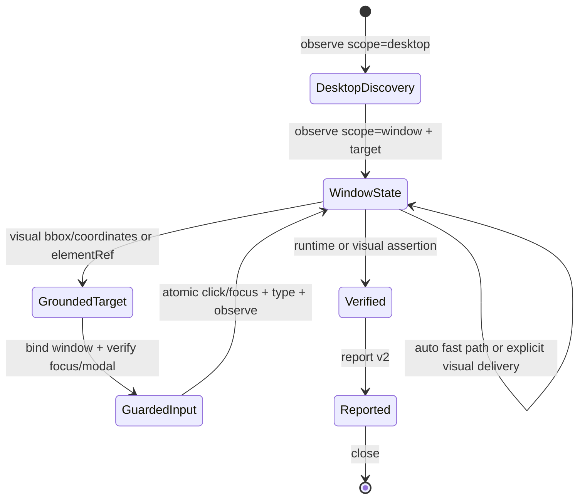

# Architecture

DeepSeekEyes is a **DSH auditable vision, MCP and Computer Use runtime**, not a standalone captioning window. DeepSeek remains the reasoning/final-answer model while the runtime controls pixel acquisition, schema validation, route health, evidence identity, bounded rereads, structured application calls, automation state and accounting.

```mermaid
flowchart LR
    A["Original DSH attachment or visually delivered Computer Use screenshot"] --> B["Content-addressed source reader"]
    B --> C["Ordered VisionRouter"]
    C --> D["Capability health check + circuit state"]
    D --> E["Randomized pixel probe"]
    E --> F["Multimodal Provider/model"]
    F --> G["Canonical JSON Schema validator"]
    G --> H["Immutable evidence cache"]
    H --> I["DeepSeek final-answer model"]
    I -->|"one missing fact"| J["Targeted original-image reread"]
    J --> C
    C --> K["Bounded failover attempt audit"]
    B --> L["Append-only DSH event + original attachment"]
    M["Browser/Desktop state machine"] --> P["Automation context + call guard"]
    P --> O["Desktop visualDelivery policy"]
    O -->|"pixels required"| B
    O -->|"semantic/action fast path"| I
    Q["Harness MCP settings"] --> R["MCP manager + official DSH MCP client"]
    R --> S["Allow/deny policy + tool/schema budgets"]
    R --> V["Opt-in Host-SDK Content plane"]
    V --> W["Resources / templates / Prompts catalog"]
    W --> S
    S --> T["DeepSeekEyes-only managed tools"]
    T --> U["Bounded preview + SHA-256 + optional artifact"]
    U --> P
    U -->|"image content"| B
    N["Usage tracker"] --- E
    N --- F
    N --- I
    N --- U
```

## Major components

| Component | Responsibility |
| :-- | :-- |
| `dsh/index.js` | Registers the virtual Provider, keeps pure-text turns on the direct path, orchestrates evidence and final reasoning. |
| `src/content.js` / `src/session.js` | Finds nested images, preserves raw events and replaces model-facing history with bounded content-addressed pointers. |
| `src/automation-context.js` | Detects active Browser/Desktop tool turns, keeps the newest user task and atomic tool tail under a configurable model-facing context/call budget, without mutating retained DSH history. |
| `src/vision.js` | Orders configured/priority/auto-detected routes, applies health TTL and circuit cooldown, executes bounded failover. |
| `src/vision-attempts.js` | Persists a bounded, privacy-reduced audit of route selection, failures, cache hits and latency. |
| `schemas/visual-evidence.schema.json` | Single source of truth for base and targeted evidence. |
| `src/evidence-schema.js` | Compiles the canonical schema with Ajv and derives the exact schema injected into prompts. |
| `src/probe.js` | Sends a randomized 3×3 pixel challenge to prove that a declared model consumes image pixels. |
| `src/cache.js` | Stores immutable SHA-256-bound evidence records in memory and optionally on disk. |
| `src/look.js` | Gives only image-bearing sessions an on-demand original-image reread tool. |
| `src/browser/*` | Playwright browser state, semantic refs, stale-state rejection, assertions and reports. |
| `src/desktop/*` | Native Windows/macOS desktop/window observation, accessibility elements/actions, state deltas, lossless screenshot evidence and conditional visual delivery. |
| `src/mcp/config.js` / `src/mcp/official-adapter.js` | Strictly validate server definitions and materialize stdio `env` / HTTP-header environment-variable references only when starting the official DSH MCP Tools client. |
| `src/mcp/content-adapter.js` / `src/mcp/host-runtime.js` | Resolve the protocol SDK owned by the active Host client, connect the opt-in Resources/Prompts plane, drain bounded catalogs and normalize read/get responses into the shared result boundary. |
| `src/mcp/manager.js` / `src/mcp/policy.js` | Own server lifecycle, health/discovery/reconnect, allow/deny policy, global exposure budgets and DeepSeekEyes Provider routing. |
| `src/mcp/result.js` / `src/mcp/audit.js` | Canonicalize and bound results, persist content-addressed complete artifacts when required, batch-admit MCP images as Harness attachments and create privacy-reduced audit summaries. |
| `src/settings.js` / `src/settings-ui.js` | Expose one strict settings contract to both the Harness-native MCP control center and runtime reconfiguration. |
| `src/usage.js` | Separates exact Provider usage, estimated bridge input, Computer Use/MCP DeepSeek calls, MCP Schema/result attribution, avoided replay and normal final-answer usage. |

## Route ordering and failover

The runtime considers routes in this order:

1. the route that produced the current base evidence, for a targeted reread;
2. the explicitly selected visual Provider/model;
3. `visionRoutePriority`, one `provider/model` per line;
4. other DSH models that explicitly declare both text and image input when auto-detection is enabled.

Each route receives a metadata health check. Successful checks are cached for `visionHealthTtlMs`. Operational failures open a circuit for `visionFailureCooldownMs`; later operations skip that route while alternatives exist. `visionFailoverAttempts` bounds additional attempts, and every health/operation/circuit decision is recorded.

## Evidence contract

The canonical schema has two strict variants:

- `deepseekeyes.evidence.v1`: summary, OCR, regions, objects, relations, quantitative facts and uncertainties;
- `deepseekeyes.target.v1`: one direct answer, literal observations, OCR and uncertainties.

Every object uses `additionalProperties: false`. OCR/region/object/observation entries require all nested fields. Bounding boxes are normalized, positive and contained by the image; confidence is `0..1`. A successful model response with an extra nested field is still rejected.

## DSH rc.8 native vision bypass

The virtual catalog resolves the final upstream model before it resolves a secondary visual route. A model that explicitly advertises image input is exposed as `Native Vision` even when no other visual Provider exists. Its current request keeps the exact Harness `ImageBlock`; DeepSeekEyes performs no base-evidence, clarification or probe call. After a successful response, the normal Surface-shadowing step retains a bounded hash/reference for future turns while the append-only source event and attachment bytes remain unchanged. Provider-reported usage is classified as the ordinary final visual turn, `nativeVisualTurns` records the bypass decision, and additional plugin Token totals remain zero.

## Desktop 0.5.8 state machine

Windows uses UI Automation runtime IDs and native window handles. macOS uses Accessibility paths scoped to a process/window. Public refs are deterministic hashes of these native identities. Pixel/ref mutations still carry the newest `stateId`; stateless application launch/name-based focus and read-only observation are resolved from live native identity instead. A stale mutation triggers observation only and never executes the requested action.

The screenshot origin and scale are returned with every state. Desktop discovery uses display coordinates. Window capture moves the origin to the target window, so model coordinates stay relative to the exact returned PNG and the native helper translates them back to global coordinates. A requested target that disappears fails explicitly instead of falling back to an unrelated full desktop image.

Text entry has a stricter target contract than ordinary pointer motion. `type` requires an `elementRef` or complete `x/y`; coordinate entry must also resolve a current target window from `windowRef` or the latest window-scoped observation. The session validates coordinate space, point containment, element/window agreement and any active modal before entering the native helper. The helper then focuses the intended window, focuses or clicks the control, rechecks native foreground identity and only then emits text. `allowFocusedTarget: true` is an explicit compatibility branch, not an implicit fallback. Focus/modal/coordinate failures happen before text dispatch.

`stateDelta.screenshotChanged` compares decoded pixel identity rather than PNG encoding bytes. Window and element deltas separately report added, removed and field-level changed refs. Semantic collection is bounded by `desktopMaxElements`; macOS also caps the walk to 40% of the native helper timeout (maximum 8 seconds) instead of materializing an unbounded `entireContents()` tree. `semanticStatus` exposes truncation, the limit reason and measured semantic time. Pixel actions remain available for games, canvases and controls absent from the accessibility tree.

`desktopVisualMode` controls only model delivery, never acquisition or evidence retention. `auto` omits image blocks when a complete semantic state or successful mutation already gives the final model enough evidence; `always` sends each captured screenshot through the visual bridge; `manual` requires `includeScreenshot: true`. Every state still retains the exact encoded/pixel hashes, attachments and configured artifact. The no-image fast path therefore enters the adapter's existing text-only branch and makes no visual Provider request.

On macOS, launch resolution uses Launch Services/`NSWorkspace` plus `/usr/bin/open` and accepts display names, renamed aliases, bundle IDs and full `.app` paths. Exact app identity is resolved to its PID before any fallback process scan, wins over substring matches, and a newly supplied application/title replaces any prior capture target. With no explicit title/ref, focused and main usable windows outrank tiny auxiliary dialogs. The runtime binds each controllable window to its CoreGraphics window number and re-resolves the corresponding Accessibility window for every action. A z-order change therefore keeps the same `windowRef` instead of reusing a mutable per-application window index. Accessibility elements use a semantic fingerprint plus duplicate ordinal; a cached traversal index is accepted only when its identity and bounds still match. Explicit window and element targets fail closed when that native identity disappears. Semantic text entry uses `AXSelectedText`; coordinate-only Unicode uses a complete pasteboard item/type snapshot, CoreGraphics paste, and restoration. `semanticStatus` marks sparse trees and directs the control loop to lossless screenshot coordinates.

## MCP 0.7 Tools and Content planes

MCP is an opt-in structured application path. DeepSeekEyes loads the official runtime pair `@deepseek-ai/dsh-mcp-client` and `@deepseek-ai/dsh-tools` from DSH's managed `$DSH_HOME/profiles/node_modules` Host fallback rather than implementing MCP framing, transports or tool-SDK rendering. Each entry is canonicalized and proved to remain inside the managed Host package root, so the current profile's `node_modules` cannot shadow it. The packages are optional Host peers across `>=0.1.0-rc.6 <0.2.0` and rc.8 source-test development pins, not installed runtime dependencies: this preserves the Host's Cordis services and symbol-keyed tool scheduler instead of creating a second core graph inside the profile. The Tools adapter runs each configured official client inside a Cordis child fiber, captures registered tool definitions, and disposes the fiber and its stdio child when disabled, reconfigured or stopped.

DSH rc.8 does not expose the official client's underlying protocol `Client` or Resources/Prompts through its public wrapper. DeepSeekEyes therefore adds a separate **Content plane** only when `resourcesEnabled` or `promptsEnabled` is true. `loadHostMcpSdk()` resolves `Client`, `StdioClientTransport` and `StreamableHTTPClientTransport` from the exact SDK dependency beside the canonical Host client entry; the plugin does not install or bundle another SDK. Tools remain wholly owned by the official DSH client. Both planes support local `stdio` and remote `streamable-http`.

Each server has independent `toolsEnabled`, `resourcesEnabled` and `promptsEnabled` switches. Tools default on for backward compatibility; Resources and Prompts default off. When both Content switches are off, no Content adapter is created, no extra process/connection is opened, and no generic Content schema or model call exists. Content discovery drains Resources, Resource Templates and Prompts under one cumulative limit of 256 entries, 256 cursor pages, 1,000,000 serialized characters and 4,000,000 UTF-8 bytes. Cursor loops, invalid entries and over-limit catalogs reject the Content plane rather than publishing a prefix.

Resources and Prompts use explicit default-empty allowlists with deny-wins selectors. The manager never injects the catalog into the system prompt. When at least one corresponding catalog item is allowed, it registers one static generic schema: `mcp__deepseekeyes__resource` and/or `mcp__deepseekeyes__prompt`. These definitions share `mcpMaxTools` and `mcpMaxSchemaTokens` with ordinary Tools. Resource execution accepts a discovered exact URI or a concrete URI matching a discovered, allowlisted template; Prompt execution accepts only a discovered name and validates declared required/string arguments before transport dispatch.

The Harness settings namespace stores a real `mcpServers` array. GUI saves and headless configuration pass through the same strict validation:

- server IDs are unique, bounded identifiers and display names are unique case-insensitively;
- stdio and HTTP fields cannot be mixed;
- stdio `env` entries and Streamable HTTP header values are represented only as `{ "env": "VARIABLE_NAME" }` and are resolved from the `dsh web` process environment when the connection starts;
- credential-looking command arguments, URL user information and credential query keys are rejected;
- remote URLs must use HTTPS; plaintext HTTP is accepted only for an explicit loopback hostname/address (`localhost`/`.localhost`, IPv4 `127/8`, IPv6 loopback and IPv4-compatible/mapped loopback forms).

The manager connects only enabled servers when the global `mcpEnabled` switch is on. It discovers tools/content, exposes independent `toolsStatus`/`contentStatus`, health, latency and errors, supports live refresh and reconnect, and responds to runtime reconfiguration without restarting DSH. `testConnection()` performs real independent Tools and Content transport probes for a mixed server; status polling tracks each plane's 30-second freshness and single-flights one due probe batch. A non-empty Tools generation becoming empty withdraws exposure and enters `unknown`; only a matching uncached zero-tool probe establishes a genuinely healthy empty catalog. A failed/mismatched probe remains disconnected instead of reporting captured data as healthy.

CaptureRegistry admits each post-client definition into one cumulative, iterative catalog budget over tool name, description, input parameters and output schema. The fixed generation ceilings are 256 tools, 1,000,000 measured JSON-like schema characters, 4,000,000 UTF-8 schema bytes, depth 64 and 100,000 schema nodes. A duplicate, invalid or over-limit definition atomically clears/rejects the entire generation so downstream capture/sorting/assembly never observes a prefix. Manager-side normalization applies the same budget to non-official adapters. New servers still expose no tools because `allowedTools` starts empty. Deny selectors win over allow selectors; only after capture does the manager apply the separate global `mcpMaxTools` and estimated Schema Token exposure budgets. Stable public names use `mcp__<server-id>__<tool-name>` with a hash suffix when normalization or length requires it.

This catalog budget is a post-client retention/traversal boundary, not a wire-level pagination budget. The verified rc.8 client fully drains and validates every `tools/list` page and builds a complete definition map before invoking CaptureRegistry. DeepSeekEyes therefore does not use this boundary to cap the byte size of one upstream page, the number of cursor pages or the Host client's temporary pre-capture map.

The surviving Tool and generic Content definitions are registered in the process-global `ctx.tools` registry so generations can be hot-swapped. That registry is not the model-facing authority: the final system-prompt assembly keeps the MCP schemas and guidance only when its selected Provider is the DeepSeekEyes virtual Provider, and strips both for every other Provider. `executeManaged()` and `executeContent()` repeat the route check and reject missing-agent as well as wrong-Provider calls before any external invocation. This two-boundary design prevents unrelated model routes from paying MCP Schema context or invoking the managed server.

Presentation mode determines how a managed result reaches the next model request. Native calls already emit their tool result directly, so `executeManaged()` does not duplicate it. A nested Code Mode call has `exec.parent` and must also have the Host-provided `exec.deferContext()` channel. DeepSeekEyes uses that channel once per successful or failed sub-call to append a plugin-authored user message with `source.kind=plugin`, `source.plugin=deepseekeyes`, `source.form=mcp-context` and a private marker prefix. The marker contains only tool identity, status, result/error digest and image count; images are separate content blocks containing immutable Harness attachment references, never inline base64. Missing `deferContext()` fails before the external call with `MCP_RESULT_CONTEXT_UNAVAILABLE`.

Only the exact plugin source plus marker prefix is accepted as an MCP continuation. Deferred contexts are kept atomic with the outer `run_code` call/result during history bounding. Consequently both successful and failed nested calls enter the automation context budget and per-instruction call guard when the outer turn continues, and Provider-reported usage for that continuation is attributed to `upstreamMcp`. MCP image references enter the existing visual evidence pipeline, where raw image blocks are replaced with validated evidence before the text-only upstream model receives the request and the original attachment remains available for targeted reread.

The continuation guard and external-call quota are separate. `automationMaxCallsPerTurn` counts final-model requests for the user instruction. `mcpMaxExternalCallsPerRun` keys a counter to the Host's opaque parent execution token, increments synchronously before every managed Code Mode transport invocation, and removes the counter when the Host run signal aborts. The default is 64 and explicit `0` is unlimited. A limit stop contributes a deferred error marker and MCP limit-stop statistic but does not increment the external-call count or contact the server. ToolRuntime concurrency and per-tool timeout remain independent; the manager's optional authorization hook is not yet wired into the packaged plugin as a per-sub-call approval prompt.

MCP server annotations are used to classify a tool as read, write, destructive or unknown-write. The pinned official client does not currently forward annotations, so missing metadata is intentionally classified as `unknown-write`; an explicit allowlist remains the authority for exposure rather than treating missing hints as read-only.

Each call passes through a staged result boundary. The verified official Host Client and MCP SDK first parse/decode the transport response. Whenever `content` is an array, the Client walks its blocks and joins extracted text before checking `isError`; it discards the temporary joined string on success and throws it on failure. DeepSeekEyes then bounds and redacts an already-created exception, but its later successful-value admission does not limit the dependency's earlier decode or pre-admission extract/join allocation.

For a successful adapter value, DeepSeekEyes next performs an iterative, non-recursive hard admission before its own canonicalization, base64 decode, attachment write or artifact persistence. The fixed limits are depth 64, 50,000 visited values, 4,096 content blocks, 16 Mi aggregate non-image string characters (including keys), 8 image blocks, 28 MiB aggregate encoded image data, 20 MiB aggregate decoded image data and 20 MiB aggregate Buffer/Uint8Array data. Admission failure returns a stable `MCP_RESULT_*_LIMIT`, creates no DeepSeekEyes attachment/artifact and records zero result-input estimate.

Only an admitted adapter value is canonicalized and SHA-256 hashed. `mcpMaxResultChars` is then applied to the model preview; it does not relax the hard admission. A truncated result—or any result containing non-text content—is written by default as an immutable, private JSON artifact under `mcpArtifactDir`. The digest and byte count identify this canonical admitted adapter value rather than wire bytes. Artifact persistence writes a private temporary file, attempts atomic rename with a direct immutable-target fallback, and best-effort removes the temporary path in a `finally` block on every exit; a write failure rejects the call and the cleanup does not replace its original error. With persistence disabled, no artifact/reference is emitted: the preview distinguishes delivered image attachments from raw image/audio/resource blocks that were not retained.

MCP image blocks are decoded first and submitted once through `ctx.attachments.saveImages()`. The current Harness Host therefore owns batch count, aggregate-byte, media-type and raster-decode admission; a validation failure publishes no prefix of attachment references. A storage failure likewise returns no partial list, although already written content-addressed objects may remain unreachable until Host retention collects them. A legacy Host that offers only `saveImage()` follows a bounded compatibility path: it applies Host-provided limits when available (otherwise 8 images, 5 MiB each, 20 MiB total), validates the whole batch, and only then writes sequentially. A later legacy storage fault has the same unreachable-object boundary and never returns a partial reference list. Successful content-addressed attachments are rendered into the tool result and enter the same visual bridge and original-pixel evidence path as other Harness images.

The bounded result becomes part of the next DeepSeek turn, so MCP continuations use the existing automation context budget and per-user-instruction call limit. Tool Schema input is estimated from each actual request surface: native mode counts MCP function definitions, Code Mode counts their generated `tools:sdk` declarations, and `both` adds the two because both are really sent. Result input is estimated once when the external call completes; a raw-admission failure records zero. Both estimates are attribution subsets of the Provider request and are not added a second time to exact Provider totals. The in-memory audit ring retains only server/tool identity, risk class, status, duration, argument/result hashes and, on failure, a stable/redacted error code plus message SHA-256. Full arguments, credentials, error messages and full results are excluded.

Reconfiguration and stop set a manager-wide exposure suspension before awaiting any transport close. `syncExposure()` removes all registered MCP definitions and the prompt section while cleanup is in flight; per-runtime close also revokes its generation before awaiting adapter disposal. Tools and Content retain separate failed-close handles and cleanup health records. A pending failure blocks a duplicate probe or replacement transport until retrying that exact handle succeeds. Content transport notifications enter the same manager queue as reconfiguration, so a stale generation cannot overwrite the replacement catalog. Reconfiguration republishes only the validated replacement set after all cleanup/connect work finishes, while stop finishes with zero exposure.

The 0.7 protocol surface covers Tools, Resources, Resource Templates and Prompts. Interactive OAuth, Sampling/Elicitation, Roots management, server sandboxing and a general background UI driver remain outside this layer. stdio inherits the `dsh web` process privileges, HTTP behavior depends on the remote server, and the agent must verify an external write from returned/read-back evidence rather than treating transport success as proof.

`npm run test:mcp` exercises the official rc.8 Tools client and the Host-SDK Content plane with temporary SDK servers over both a real stdio child lifecycle and a real loopback Streamable HTTP lifecycle, including Tools call/probe/refresh plus Resources, Resource Templates, Prompts, text/image content and disposal. Package verification and doctor additionally require the compatible Host-peer boundary, all three protocol SDK exports and no runtime dependency on the core pair; clean-profile acceptance verifies actual Loader resolution, native execution and scheduler identity. These checks validate those local protocol/package paths, not an arbitrary external deployment or TLS certificate.

## Failure semantics

- Attachment identity/persistence failures are route-independent and stop immediately.
- Provider, probe, malformed-output and schema failures are eligible for bounded failover.
- Reasoning-prefixed/multi-object evidence is selected by contract; known empty-list and numeric/bbox structure is canonicalized locally and audited before the unchanged strict Schema gate.
- A recognizable incomplete SSE transport may retry once on the same route. Retry attempts and Provider-reported usage remain visible.
- A single-route failure preserves its original error code; multi-route exhaustion returns `VISION_FAILOVER_EXHAUSTED` plus structured attempts.
- The final DeepSeek model never receives unvalidated evidence.
- Desktop screenshot exhaustion may forward only the already-validated native semantic state plus an explicit pixels-not-decoded marker; ordinary uploaded images remain fail-closed.
- Pure-text turns create no vision route, probe, screenshot or attempt record.
- Native desktop refs are current-state capabilities: stale refs do not execute actions, and missing window captures do not silently widen to the desktop.
- Target-bound desktop input fails before text dispatch when focus, modal state, coordinate space, target bounds or element/window identity no longer match the latest observation.
- MCP connection failure leaves that server unhealthy and exposes none of its tools; other configured servers remain independently available.
- Invalid/duplicate/over-limit captured catalogs reject the whole server generation without publishing a prefix; a non-empty-to-zero transition removes exposure until a live zero-tool probe confirms it.
- Catalog bounds apply only after the official Host Client has drained/validated paginated discovery and built its temporary definition map, so they do not bound upstream page bytes or cursor count.
- Missing credential environment variables, disallowed tools, exhausted exposure budgets and a non-DeepSeekEyes active Provider stop before the external tool call.
- A nested Code Mode call without the Host `deferContext()` channel stops before the server call with `MCP_RESULT_CONTEXT_UNAVAILABLE`; native mode never emits a duplicate deferred result.
- An oversized successful adapter result fails the fixed post-client raw admission before DeepSeekEyes canonicalization, base64 decode, attachment/artifact persistence or result-token attribution; the official client's earlier transport decode and unconditional extract/join of array-valued `content` remain dependency behavior.
- MCP image-batch admission failure stops the call before returning attachment references; the legacy saveImage-only path can leave unreachable immutable blobs after a storage fault but never exposes a partial list.
- MCP result persistence failure rejects that call rather than substituting an untraceable complete result; temporary-file cleanup runs best-effort without masking the authoritative failure. Already bounded in-memory results and unrelated text/vision paths remain isolated.
- Stop and reconfigure revoke all MCP schemas/guidance before asynchronous cleanup and keep exposure suspended until the validated final generation is ready.
- With MCP disabled or with no allowlisted connected tool, the runtime registers no MCP definition or MCP system-prompt section, so ordinary pure-text turns retain the direct path.
