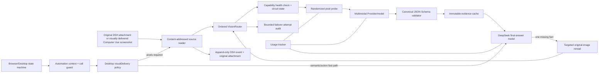
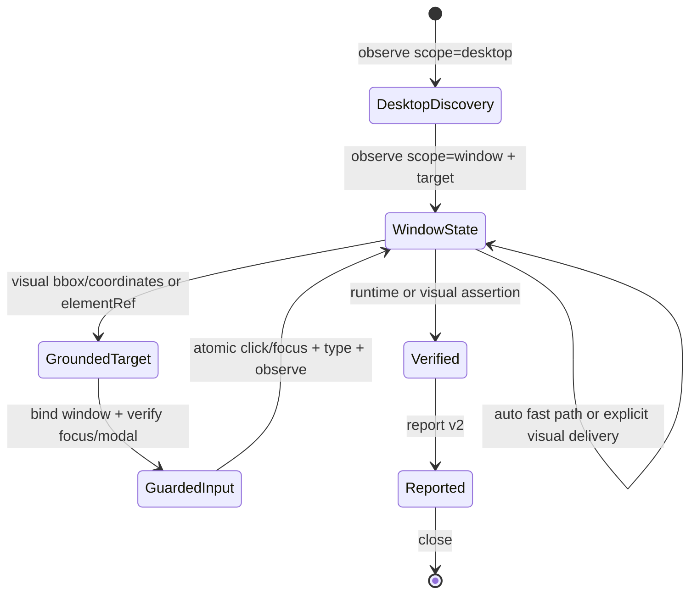

# Architecture

DeepSeekEyes is a **DSH auditable vision and Computer Use runtime**, not a standalone captioning window. DeepSeek remains the reasoning/final-answer model while the runtime controls pixel acquisition, schema validation, route health, evidence identity, bounded rereads, automation state and accounting.

## Major components

| Component | Responsibility |
| :-- | :-- |
| `dsh/index.js` | Registers the virtual Provider, keeps pure-text turns on the direct path, orchestrates evidence and final reasoning. |
| `src/content.js` / `src/session.js` | Finds nested images, preserves raw events and replaces model-facing history with bounded content-addressed pointers. |
| `src/automation-context.js` | Detects active Browser/Desktop tool turns, keeps the newest user task and atomic tool tail under a configurable model-facing context/call budget, without mutating retained DSH history. |
| `src/vision.js` | Orders configured/priority/auto-detected routes, applies health TTL and circuit cooldown, executes bounded failover. |
| `src/vision-attempts.js` | Persists a bounded, privacy-reduced audit of route selection, failures, cache hits and latency. |
| `schemas/visual-evidence.schema.json` | Single source of truth for base and targeted evidence. |
| `src/evidence-schema.js` | Compiles the canonical schema with Ajv and derives the exact schema injected into prompts. |
| `src/probe.js` | Sends a randomized 3×3 pixel challenge to prove that a declared model consumes image pixels. |
| `src/cache.js` | Stores immutable SHA-256-bound evidence records in memory and optionally on disk. |
| `src/look.js` | Gives only image-bearing sessions an on-demand original-image reread tool. |
| `src/browser/*` | Playwright browser state, semantic refs, stale-state rejection, assertions and reports. |
| `src/desktop/*` | Native Windows/macOS desktop/window observation, accessibility elements/actions, state deltas, lossless screenshot evidence and conditional visual delivery. |
| `src/usage.js` | Separates exact Provider usage, estimated bridge input, Computer Use DeepSeek calls, avoided replay and normal final-answer usage. |

## Route ordering and failover

The runtime considers routes in this order:

1. the route that produced the current base evidence, for a targeted reread;
2. the explicitly selected visual Provider/model;
3. `visionRoutePriority`, one `provider/model` per line;
4. other DSH models that explicitly declare both text and image input when auto-detection is enabled.

Each route receives a metadata health check. Successful checks are cached for `visionHealthTtlMs`. Operational failures open a circuit for `visionFailureCooldownMs`; later operations skip that route while alternatives exist. `visionFailoverAttempts` bounds additional attempts, and every health/operation/circuit decision is recorded.

## Evidence contract

The canonical schema has two strict variants:

- `deepseekeyes.evidence.v1`: summary, OCR, regions, objects, relations, quantitative facts and uncertainties;
- `deepseekeyes.target.v1`: one direct answer, literal observations, OCR and uncertainties.

Every object uses `additionalProperties: false`. OCR/region/object/observation entries require all nested fields. Bounding boxes are normalized, positive and contained by the image; confidence is `0..1`. A successful model response with an extra nested field is still rejected.

## Desktop 0.5.8 state machine

Windows uses UI Automation runtime IDs and native window handles. macOS uses Accessibility paths scoped to a process/window. Public refs are deterministic hashes of these native identities. Pixel/ref mutations still carry the newest `stateId`; stateless application launch/name-based focus and read-only observation are resolved from live native identity instead. A stale mutation triggers observation only and never executes the requested action.

The screenshot origin and scale are returned with every state. Desktop discovery uses display coordinates. Window capture moves the origin to the target window, so model coordinates stay relative to the exact returned PNG and the native helper translates them back to global coordinates. A requested target that disappears fails explicitly instead of falling back to an unrelated full desktop image.

Text entry has a stricter target contract than ordinary pointer motion. `type` requires an `elementRef` or complete `x/y`; coordinate entry must also resolve a current target window from `windowRef` or the latest window-scoped observation. The session validates coordinate space, point containment, element/window agreement and any active modal before entering the native helper. The helper then focuses the intended window, focuses or clicks the control, rechecks native foreground identity and only then emits text. `allowFocusedTarget: true` is an explicit compatibility branch, not an implicit fallback. Focus/modal/coordinate failures happen before text dispatch.

`stateDelta.screenshotChanged` compares decoded pixel identity rather than PNG encoding bytes. Window and element deltas separately report added, removed and field-level changed refs. Semantic collection is bounded by `desktopMaxElements`; macOS also caps the walk to 40% of the native helper timeout (maximum 8 seconds) instead of materializing an unbounded `entireContents()` tree. `semanticStatus` exposes truncation, the limit reason and measured semantic time. Pixel actions remain available for games, canvases and controls absent from the accessibility tree.

`desktopVisualMode` controls only model delivery, never acquisition or evidence retention. `auto` omits image blocks when a complete semantic state or successful mutation already gives the final model enough evidence; `always` sends each captured screenshot through the visual bridge; `manual` requires `includeScreenshot: true`. Every state still retains the exact encoded/pixel hashes, attachments and configured artifact. The no-image fast path therefore enters the adapter's existing text-only branch and makes no visual Provider request.

On macOS, launch resolution uses Launch Services/`NSWorkspace` plus `/usr/bin/open` and accepts display names, renamed aliases, bundle IDs and full `.app` paths. Exact app identity is resolved to its PID before any fallback process scan, wins over substring matches, and a newly supplied application/title replaces any prior capture target. With no explicit title/ref, focused and main usable windows outrank tiny auxiliary dialogs. The runtime binds each controllable window to its CoreGraphics window number and re-resolves the corresponding Accessibility window for every action. A z-order change therefore keeps the same `windowRef` instead of reusing a mutable per-application window index. Accessibility elements use a semantic fingerprint plus duplicate ordinal; a cached traversal index is accepted only when its identity and bounds still match. Explicit window and element targets fail closed when that native identity disappears. Semantic text entry uses `AXSelectedText`; coordinate-only Unicode uses a complete pasteboard item/type snapshot, CoreGraphics paste, and restoration. `semanticStatus` marks sparse trees and directs the control loop to lossless screenshot coordinates.

## Failure semantics

- Attachment identity/persistence failures are route-independent and stop immediately.
- Provider, probe, malformed-output and schema failures are eligible for bounded failover.
- Reasoning-prefixed/multi-object evidence is selected by contract; known empty-list and numeric/bbox structure is canonicalized locally and audited before the unchanged strict Schema gate.
- A recognizable incomplete SSE transport may retry once on the same route. Retry attempts and Provider-reported usage remain visible.
- A single-route failure preserves its original error code; multi-route exhaustion returns `VISION_FAILOVER_EXHAUSTED` plus structured attempts.
- The final DeepSeek model never receives unvalidated evidence.
- Desktop screenshot exhaustion may forward only the already-validated native semantic state plus an explicit pixels-not-decoded marker; ordinary uploaded images remain fail-closed.
- Pure-text turns create no vision route, probe, screenshot or attempt record.
- Native desktop refs are current-state capabilities: stale refs do not execute actions, and missing window captures do not silently widen to the desktop.
- Target-bound desktop input fails before text dispatch when focus, modal state, coordinate space, target bounds or element/window identity no longer match the latest observation.
